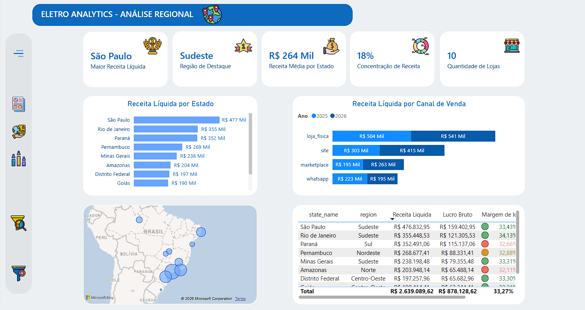
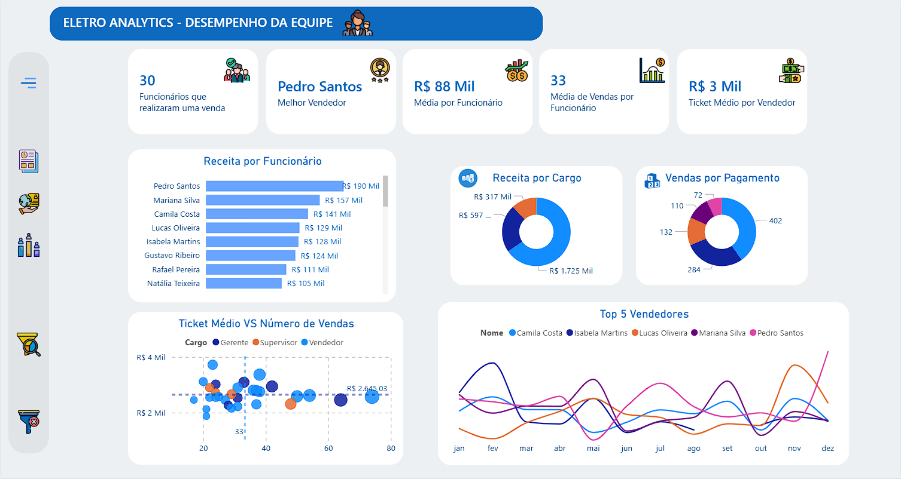
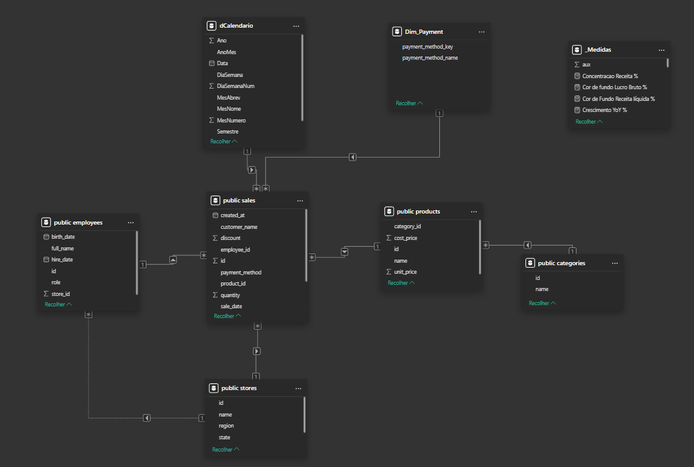

  

# 📊 Sales Analytics Dashboard

> Dashboard completo de análise de vendas de uma empresa do setor de **eletroeletrônicos**, construído com **Power BI** e alimentado por um banco de dados **PostgreSQL (Supabase)**.

---

## Índice

1. [Visão Geral do Projeto](#1-visão-geral-do-projeto)
2. [Screenshots do Dashboard](#2-screenshots-do-dashboard)
3. [Arquitetura e Tecnologias](#3-arquitetura-e-tecnologias)
4. [Estrutura do Repositório](#4-estrutura-do-repositório)
5. [Modelagem de Dados](#5-modelagem-de-dados)
6. [Páginas do Dashboard](#6-páginas-do-dashboard)
7. [Principais Métricas e KPIs](#7-principais-métricas-e-kpis)
8. [Como Reproduzir o Projeto](#8-como-reproduzir-o-projeto)
9. [Documentação Adicional](#9-documentação-adicional)

---

## 1. Visão Geral do Projeto

O **Sales Analytics Dashboard** é um projeto de Business Intelligence que centraliza e visualiza os dados de vendas de uma empresa de eletroeletrônicos com operações em todo o Brasil. O projeto cobre **dois anos completos de dados** (janeiro/2025 a dezembro/2026), com **1.000 registros de vendas** gerados de forma realista, refletindo:

- **Sazonalidade** — Black Friday, Natal, Dia das Mães, Dia dos Pais, Dia dos Namorados, Dia das Crianças
- **Distribuição geográfica** — 10 filiais nas 5 regiões do Brasil
- **Crescimento ano a ano** — 2026 apresenta um crescimento de ~16% frente a 2025
- **Comportamento de mercado** — canais digitais (site e marketplace) crescendo em relação a 2025

| Dimensão         | Detalhe                                              |
|------------------|------------------------------------------------------|
| Período          | Jan/2025 – Dez/2026                                  |
| Total de Vendas  | 1.000 registros                                      |
| Produtos         | 40 itens em 8 categorias                             |
| Lojas            | 10 filiais em 5 regiões                              |
| Funcionários     | 30 colaboradores (Vendedor, Gerente, Supervisor)     |
| Canais de Venda  | Loja Física, Site, Marketplace, WhatsApp             |
| Formas Pagamento | PIX, Cartão de Crédito, Cartão de Débito, Boleto e Dinheiro |

---

## 2. Screenshots do Dashboard

<table>
  <tr>
    <td align="center">
      
      <br/><sub><b>Visão Executiva</b></sub>
    </td>
    <td align="center">
      
      <br/><sub><b>Análise Regional</b></sub>
    </td>
  </tr>
  <tr>
    <td align="center" colspan="2">
      
      <br/><sub><b>Desempenho da Equipe</b></sub>
    </td>
  </tr>
</table>

---

## 3. Arquitetura e Tecnologias

```
PostgreSQL (Supabase)
        │
        │  Conector PostgreSQL nativo
        ▼
    Power BI Desktop
        │
        ├── Power Query (ETL)
        ├── Modelo Estrela (Star Schema)
        ├── Medidas DAX
        └── Relatório .pbix
```

| Tecnologia     | Uso                                         |
|----------------|---------------------------------------------|
| PostgreSQL     | Banco de dados relacional (Supabase)        |
| Supabase       | plataforma de banco de dados gerenciado     |
| Power BI Desktop | Modelagem, DAX e visualizações            |
| Power Query (M) | Transformações e limpeza de dados          |
| DAX            | Medidas e colunas calculadas               |

---

## 4. Estrutura do Repositório

```
sales_analytics_dashboard/
│
├── assets/
│   ├── icons/              # Ícones utilizados nos visuais do Power BI
│   │   ├── revenue.png
│   │   ├── sales.png
│   │   ├── store.png
│   │   ├── people.png
│   │   └── ...             # 23 ícones no total
│   │
│   └── images/             # Screenshots do dashboard e diagrama ER
│       ├── card_1.png
│       ├── card_2.png
│       ├── card_3.png
│       └── table_relationship.png
│
├── data/
│   ├── 01_create_tables.sql   # DDL: criação das tabelas e índices
│   ├── 02_seed_dimensions.sql # DML: carga de categorias, lojas, funcionários e produtos
│   ├── 03_seed_sales_v2.sql   # DML: geração probabilística de 1.000 vendas
│   └── validation.sql         # Consultas de validação e análise exploratória
│
├── docs/
│   ├── banco-de-dados.md      # Schema detalhado, dicionário de dados e relacionamentos
│   ├── medidas-dax.md         # Todas as medidas DAX com explicação e sintaxe
│   └── analises.md            # Análises de negócio e insights do dashboard
│
├── sales_analytics.pbix       # Arquivo do relatório Power BI (abrir no Power BI Desktop)
└── README.md                  # Este arquivo
```

---

## 5. Modelagem de Dados

O modelo segue o padrão **Star Schema**, com a tabela `sales` como **fato central** e seis dimensões ao redor.



| Tabela       | Tipo       | Descrição                                             |
|--------------|------------|-------------------------------------------------------|
| `sales`      | Fato       | Registros de venda (1.000 linhas)                     |
| `products`   | Dimensão   | 40 produtos com preço de venda e custo                |
| `categories` | Dimensão   | 8 categorias de produtos                              |
| `stores`     | Dimensão   | 10 filiais com estado e região                        |
| `employees`  | Dimensão   | 30 funcionários com cargo e loja de lotação           |
| `dCalendario` | Dimensão  | Tabela calendário para **time intelligence functions**|

> Para o schema completo, dicionário de dados e scripts SQL, consulte [docs/banco-de-dados.md](docs/banco-de-dados.md).

---

## 6. Estrutura do Dashboard

O relatório é composto por **uma única página** com navegação dinâmica entre três visões, alternadas por botões de menu:

### Visão Executiva
Painel executivo com os KPIs mais relevantes do negócio:
- Receita Líquida total e comparação YoY%
- Número de vendas e ticket médio
- Lucro bruto e margem de lucro

### Análise Regional
Análise geográfica e comparativa entre filiais:
- Mapa com receita por estado
- Ranking de filiais por faturamento
- Participação percentual de cada região
- Comparativo de crescimento por filial (2025 vs 2026)

### Desempenho da Equipe
Desempenho individual e por cargo:
- Ranking de vendedores por receita gerada
- Ticket médio por colaborador
- Número de vendas por colaborador
- Gráfico de dispersão: volume × ticket médio
- Filtro por loja e cargo (Vendedor / Gerente / Supervisor)

---

## 7. Principais Métricas e KPIs

### Medidas Base

| KPI                | Fórmula DAX                                             | Formato     |
|--------------------|--------------------------------------------------------|-------------|
| Receita Bruta      | `SUMX(sales, unit_price_at_sale * quantity)`           | Moeda R$    |
| Receita Líquida    | `Receita Bruta - Total Descontos`                      | Moeda R$    |
| Custo Total        | `SUMX(sales, RELATED(cost_price) * quantity)`          | Moeda R$    |
| Lucro Bruto        | `Receita Líquida - Custo Total`                        | Moeda R$    |
| Margem Bruta %     | `DIVIDE(Lucro Bruto, Receita Líquida, 0)`              | Percentual  |
| Ticket Médio       | `DIVIDE(Receita Líquida, Num Vendas, 0)`               | Moeda R$    |

### Medidas de Time Intelligence

| KPI                     | Fórmula DAX                                              | Uso               |
|-------------------------|----------------------------------------------------------|--------------------|
| Crescimento YoY %       | `DIVIDE(Atual - Anterior, Anterior, BLANK())`            | Card KPI          |
| Receita YTD             | `CALCULATE([Receita], DATESYTD(dCalendario[Data]))`      | Acumulado no ano  |
| Receita Período Anterior| `CALCULATE([Receita], SAMEPERIODLASTYEAR(...))`          | Comparativo       |

### Medidas de Ranking e Texto

| KPI                       | Técnica DAX                                           | Uso                    |
|---------------------------|------------------------------------------------------|------------------------|
| Estado Top                | `ADDCOLUMNS + TOPN + MAXX`                           | Card de texto          |
| Melhor Vendedor           | `ADDCOLUMNS + TOPN + MAXX`                           | Card de texto          |
| Top 5 Vendedores          | `RANKX + ALLSELECTED + IF/BLANK`                     | Gráfico de linhas      |
| Concentração Top Estado % | `MAXX(tabela virtual) / CALCULATE([Receita], ALL())` | Card de percentual     |

> Para todas as fórmulas DAX completas e comentadas, consulte [docs/medidas-dax.md](docs/medidas-dax.md).

---

## 8. Como Reproduzir o Projeto

### Pré-requisitos

- [Power BI Desktop](https://powerbi.microsoft.com/pt-br/desktop/) (versão mais recente)
- Conta no [Supabase](https://supabase.com/) (gratuita) **ou** instância local do PostgreSQL
- Cliente SQL (pgAdmin, DBeaver, psql etc.)

---

### Passo 1 — Criar o banco de dados

Abra o cliente SQL conectado ao seu PostgreSQL e execute os scripts em ordem:

```sql
-- 1. Cria todas as tabelas e índices
\i data/01_create_tables.sql

-- 2. Popula dimensões (categorias, lojas, funcionários, produtos)
\i data/02_seed_dimensions.sql

-- 3. Gera 1.000 registros de venda realistas
\i data/03_seed_sales_v2.sql
```

> **Supabase:** acesse o **SQL Editor** do seu projeto e cole o conteúdo de cada arquivo na ordem acima.

---

### Passo 2 — Validar os dados

Execute o script de validação para confirmar que a carga foi bem-sucedida:

```sql
\i data/validation.sql
```

Resultados esperados:

| Verificação                  | Valor esperado |
|------------------------------|----------------|
| Total de vendas              | 1.000          |
| Vendas em 2025               | ~480           |
| Vendas em 2026               | ~520           |
| Lojas distintas              | 10             |
| Produtos distintos           | 40             |

---

### Passo 3 — Abrir o arquivo Power BI

O arquivo `sales_analytics.pbix` já contém o modelo completo, as medidas DAX e o layout do relatório. Basta reconectar à sua fonte de dados:

1. Abra o **Power BI Desktop** e carregue o arquivo `sales_analytics.pbix`
2. Vá em **Transformar Dados → Configurações da Fonte de Dados** e atualize as credenciais

Ou, para construir do zero a partir das tabelas:

1. Abra o **Power BI Desktop**
2. Clique em **Obter Dados → PostgreSQL**
3. Informe o **servidor** (ex.: `db.xxxx.supabase.co`) e o **banco** (ex.: `postgres`)
4. Informe as credenciais de acesso
5. Selecione todas as 5 tabelas: `sales`, `products`, `categories`, `stores`, `employees`

---

### Passo 4 — Transformações no Power Query

Após carregar as tabelas, aplique no **Power Query Editor**:

| Tabela       | Transformação                                                     |
|--------------|-------------------------------------------------------------------|
| `sales`      | Coluna `sale_date`: alterar tipo para `Data/Hora` (sem fuso)     |
| `sales`      | Adicionar coluna `sale_date_only`: Adicionar Coluna → Data → Somente Data |
| `employees`  | Confirmar `birth_date` e `hire_date` como tipo `Data`            |
| Todas        | Confirmar colunas `id` e FKs como `Número Inteiro`              |


> **Dica:** Crie também uma tabela calendário (`dCalendario`) para habilitar funções de time intelligence no DAX.

**Tabela Calendário — Power Query (M):**
```powerquery
let
    // Define o intervalo de datas (cobrindo todo o período dos dados)
    DataInicio = #date(2025, 1, 1),
    DataFim    = #date(2026, 12, 31),

    // Gera lista de datas
    TotalDias    = Duration.Days(DataFim - DataInicio) + 1,
    ListaDatas   = List.Dates(DataInicio, TotalDias, #duration(1, 0, 0, 0)),

    // Converte em tabela
    Tabela = Table.FromList(ListaDatas, Splitter.SplitByNothing(), {"Data"}, null, ExtraValues.Error),

    // Define tipo
    TipoData = Table.TransformColumnTypes(Tabela, {{"Data", type date}}),

    // Adiciona colunas derivadas
    Ano       = Table.AddColumn(TipoData,  "Ano",         each Date.Year([Data]),                    Int64.Type),
    Mes       = Table.AddColumn(Ano,        "MesNumero",   each Date.Month([Data]),                   Int64.Type),
    MesNome   = Table.AddColumn(Mes,        "MesNome",     each Date.ToText([Data], "MMMM", "pt-BR"),  type text),
    MesAbrev  = Table.AddColumn(MesNome,    "MesAbrev",    each Date.ToText([Data], "MMM", "pt-BR"),    type text),
    AnoMes    = Table.AddColumn(MesAbrev,   "AnoMes",      each Date.ToText([Data], "yyyy-MM"),         type text),
    Trimestre = Table.AddColumn(AnoMes,     "Trimestre",   each "Q" & Text.From(Date.QuarterOfYear([Data])), type text),
    DiaSemana = Table.AddColumn(Trimestre,  "DiaSemana",   each Date.DayOfWeekName([Data], "pt-BR"),    type text),
    DiaNum    = Table.AddColumn(DiaSemana,  "DiaSemanaNum",each Date.DayOfWeek([Data], Day.Monday) + 1, Int64.Type),
    Semestre  = Table.AddColumn(DiaNum,     "Semestre",    each if Date.Month([Data]) <= 6 then "1º Sem" else "2º Sem", type text)
in
    Semestre
```

---

### Passo 5 — Criar os Relacionamentos no Power BI

No modo **Vista do Modelo**, crie os seguintes relacionamentos (todos `N:1`, filtro único):

| De (Tabela)   | Coluna          | Para (Tabela)   | Coluna    | Cardinalidade | Filtro  |
|---------------|-----------------|-----------------|-----------|---------------|---------|
| `dCalendario` | `Data`          | `sales`         | `sale_date_only` | 1:N     | Único   |
| `categories`  | `id`            | `products`      | `category_id`   | 1:N     | Único   |
| `products`    | `id`            | `sales`         | `product_id`     | 1:N     | Único   |
| `employees`   | `id`            | `sales`         | `employee_id`    | 1:N     | Único   |
| `stores`      | `id`            | `sales`         | `store_id`       | 1:N     | Único   |

> **Importante:** Use `sale_date_only` (tipo Date, sem horário) para o relacionamento com `dCalendario`, não a coluna `sale_date` original (tipo DateTime).
---

### Passo 6 — Criar as Medidas DAX

1. Crie a tabela de medidas: **Modelagem → Nova Tabela:**

```dax
_Medidas = ROW("aux", BLANK())
```

2. Adicione as medidas principais (exemplos):

```dax
// Receita Líquida
Receita Liquida =
  SUMX(sales, sales[unit_price_at_sale] * sales[quantity]) - SUM(sales[discount])

// Lucro Bruto
Lucro Bruto =
  [Receita Liquida] - SUMX(sales, RELATED(products[cost_price]) * sales[quantity])

// Margem de Lucro %
Margem de Lucro % = 
  DIVIDE([Lucro Bruto], [Receita Liquida], 0)

// Crescimento YoY %
Crescimento YoY % =
  VAR Atual    = [Receita Liquida]
  VAR Anterior = CALCULATE([Receita Liquida], SAMEPERIODLASTYEAR(dCalendario[Data]))
  RETURN 
    DIVIDE(Atual - Anterior, Anterior, BLANK())

// Top 5 Vendedores (para gráfico de linhas)
Top 5 Vendedores =
  VAR RankVendedor =
      RANKX(
          ALL('public employees'[full_name]),
          CALCULATE([Receita Liquida], ALLSELECTED(dCalendario)),
          , DESC, DENSE
      )
  RETURN 
    IF(RankVendedor <= 5, [Receita Liquida], BLANK())

// Concentração Top Estado %
Concentracao Top Estado % =
  VAR Total = CALCULATE([Receita Liquida], ALL(stores))
  VAR TabelaEstados = ADDCOLUMNS(ALL(stores[state]), "@receita", [Receita Liquida])
  VAR TopReceita = MAXX(TabelaEstados, [@receita])
  RETURN 
    DIVIDE(TopReceita, Total, 0)
```

> Para o catálogo completo de medidas DAX com explicações detalhadas, consulte [docs/medidas-dax.md](docs/medidas-dax.md).

---

## 9. Documentação Adicional

| Documento | Conteúdo |
|-----------|----------|
| [docs/banco-de-dados.md](docs/banco-de-dados.md) | Schema completo, dicionário de dados, índices, relacionamentos e scripts SQL explicados |
| [docs/medidas-dax.md](docs/medidas-dax.md) | Todas as medidas DAX organizadas por categoria, com lógica explicada e exemplos |
| [docs/analises.md](docs/analises.md) | Análises de negócio, insights por dimensão e interpretação dos resultados do dashboard |


<div align="center">
    <hr/>
    <p>Feito com ❤️ e ☕ por <b>Igor Scalzer</b></p>
</div>
