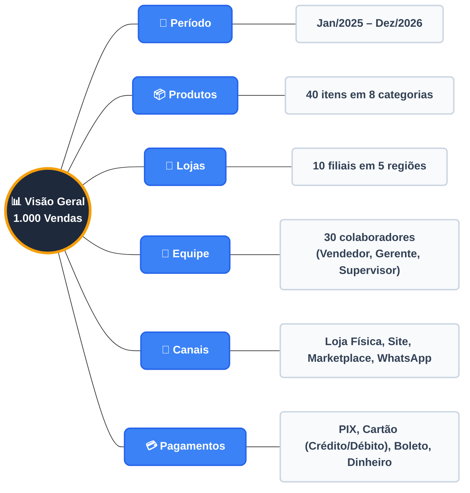
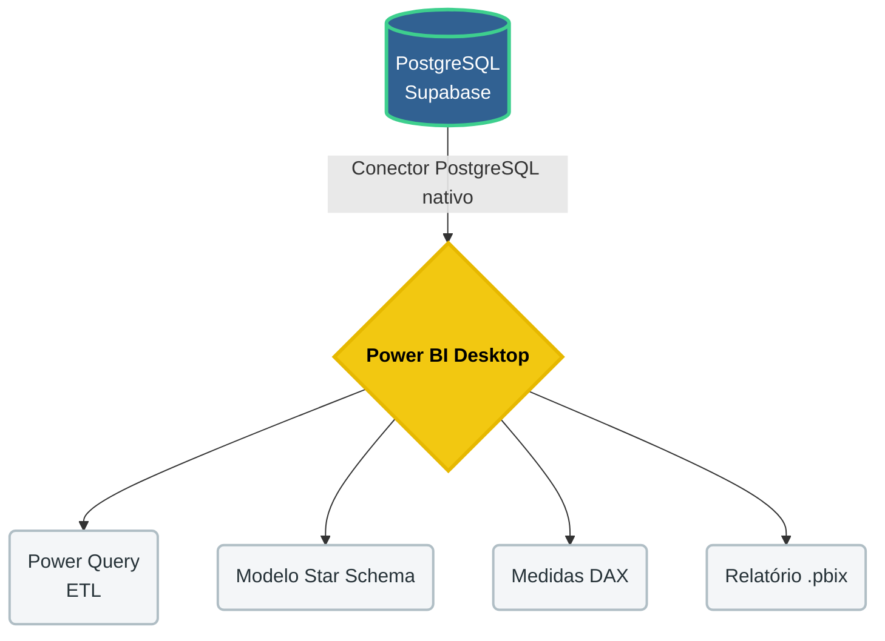
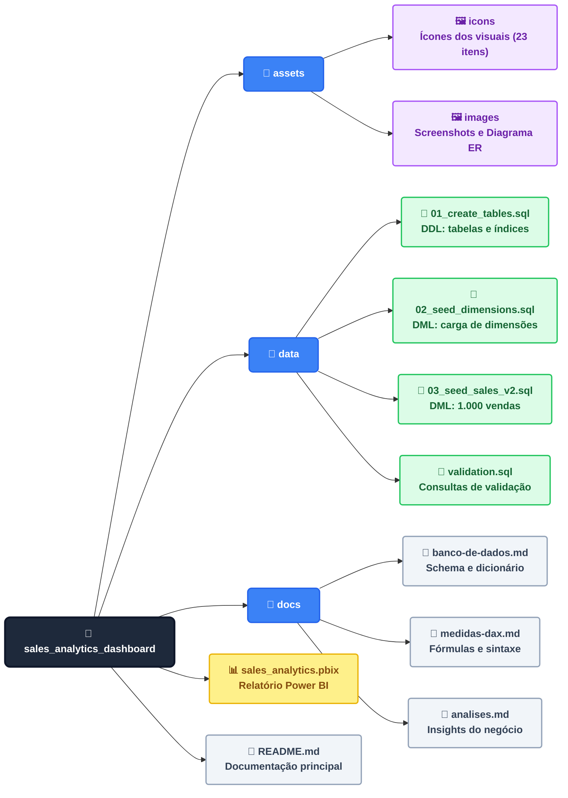
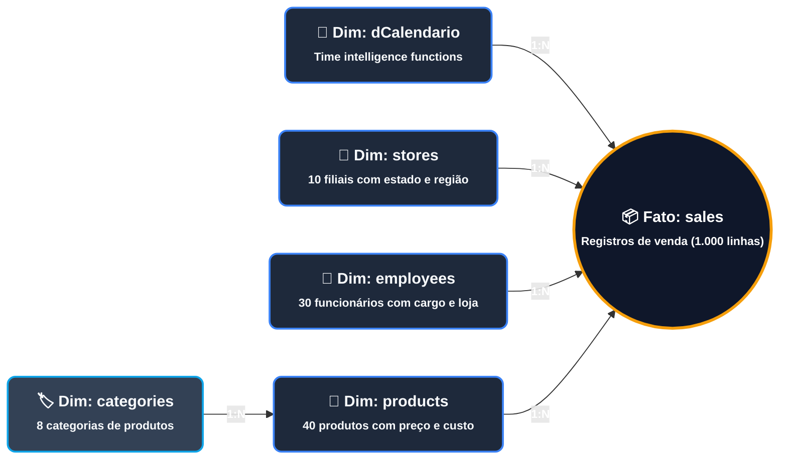
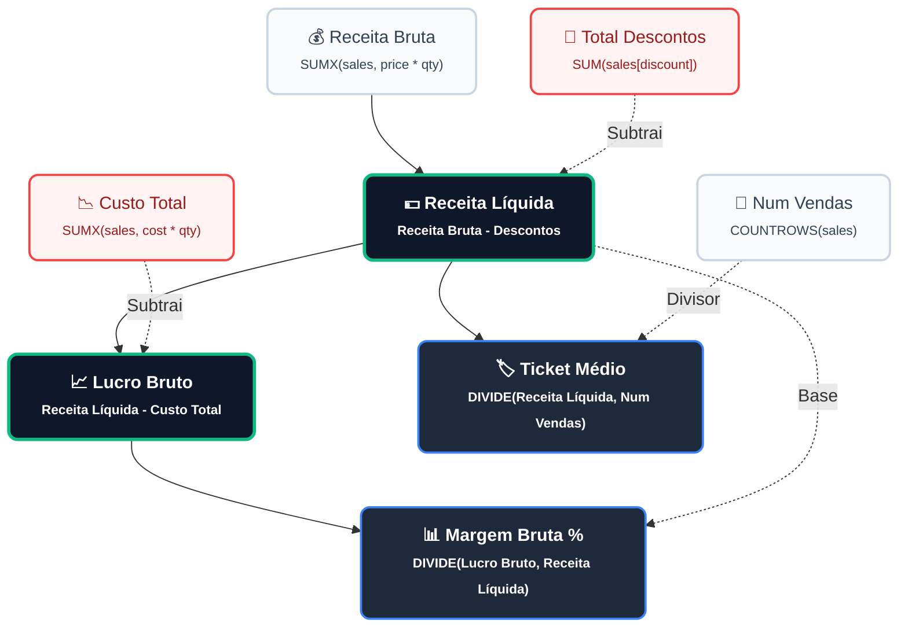
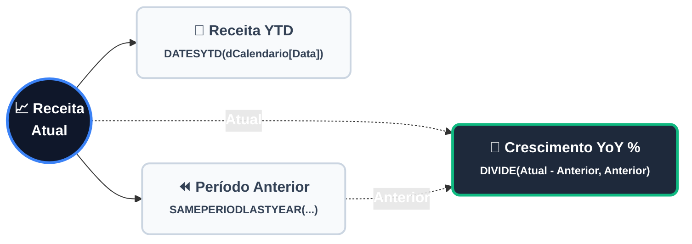
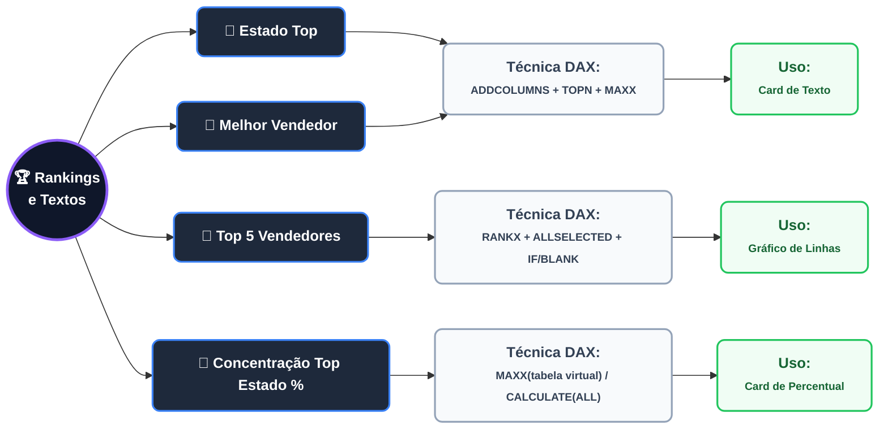
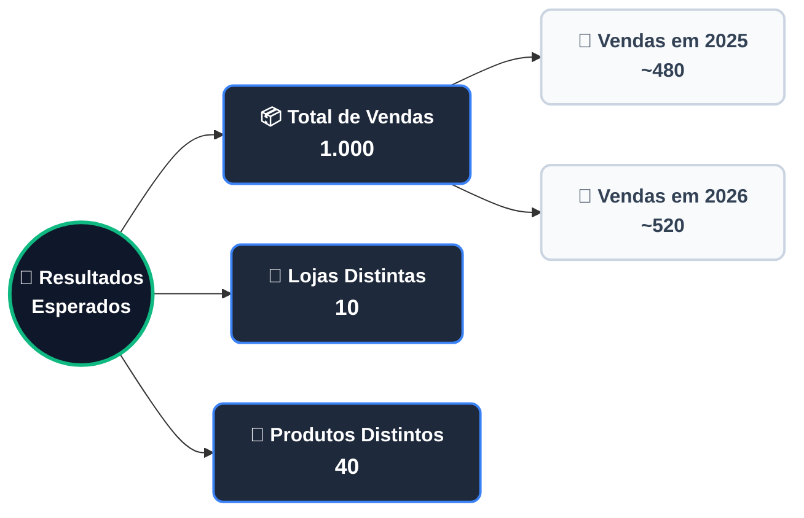

  

# 📊 Sales Analytics Dashboard

> Dashboard completo de análise de vendas de uma empresa do setor de **eletroeletrônicos**, construído com **Power BI** e alimentado por um banco de dados **PostgreSQL (Supabase)**.

---

## Índice

- **💡 Introdução**
  - [1. Visão Geral do Projeto](#1-visão-geral-do-projeto)
  - [2. Screenshots do Dashboard](#2-screenshots-do-dashboard)
- **⚙️ Engenharia**
  - [3. Arquitetura e Tecnologias](#3-arquitetura-e-tecnologias)
  - [4. Estrutura do Repositório](#4-estrutura-do-repositório)
  - [5. Modelagem de Dados](#5-modelagem-de-dados)
- **📊 Business Intelligence**
  - [6. Estrutura do Dashboard](#6-estrutura-do-dashboard)
  - [7. Principais Métricas e KPIs](#7-principais-métricas-e-kpis)
- **🚀 Prática e Guias**
  - [8. Como Reproduzir o Projeto](#8-como-reproduzir-o-projeto)
  - [9. Documentação Adicional](#9-documentação-adicional)

---

## 1. Visão Geral do Projeto

O **Sales Analytics Dashboard** é um projeto de Business Intelligence que centraliza e visualiza os dados de vendas de uma empresa de eletroeletrônicos com operações em todo o Brasil. O projeto cobre **dois anos completos de dados** (janeiro/2025 a dezembro/2026), com **1.000 registros de vendas** gerados de forma realista, refletindo:

- **Sazonalidade** — Black Friday, Natal, Dia das Mães, Dia dos Pais, Dia dos Namorados, Dia das Crianças
- **Distribuição geográfica** — 10 filiais nas 5 regiões do Brasil
- **Crescimento ano a ano** — 2026 apresenta um crescimento de ~16% frente a 2025
- **Comportamento de mercado** — canais digitais (site e marketplace) crescendo em relação a 2025


```mermaid
flowchart LR
  %% Nó Central
  Root(("📊 Visão Geral<br>1.000 Vendas"))

  %% Nós de Dimensão
  D1["📅 Período"]
  D2["📦 Produtos"]
  D3["🏪 Lojas"]
  D4["👥 Equipe"]
  D5["🛒 Canais"]
  D6["💳 Pagamentos"]

  %% Nós de Detalhe
  V1["Jan/2025 – Dez/2026"]
  V2["40 itens em 8 categorias"]
  V3["10 filiais em 5 regiões"]
  V4["30 colaboradores<br>(Vendedor, Gerente, Supervisor)"]
  V5["Loja Física, Site, Marketplace, WhatsApp"]
  V6["PIX, Cartão (Crédito/Débito), Boleto, Dinheiro"]

  %% Conexões
  Root --- D1 --- V1
  Root --- D2 --- V2
  Root --- D3 --- V3
  Root --- D4 --- V4
  Root --- D5 --- V5
  Root --- D6 --- V6

  %% Paleta de Cores Elegante
  classDef root fill:#1E293B,stroke:#F59E0B,stroke-width:4px,color:#FFFFFF,font-weight:bold;
  classDef dim fill:#3B82F6,stroke:#2563EB,stroke-width:2px,color:#FFFFFF,font-weight:bold,rx:8,ry:8;
  classDef val fill:#F8FAFC,stroke:#CBD5E1,stroke-width:2px,color:#334155,rx:5,ry:5;

  class Root root;
  class D1,D2,D3,D4,D5,D6 dim;
  class V1,V2,V3,V4,V5,V6 val;
```

---

## 2. Screenshots do Dashboard

<table>
  <tr>
    <td align="center">
      
      <br/><sub><b>Visão Executiva</b></sub>
    </td>
    <td align="center">
      
      <br/><sub><b>Análise Regional</b></sub>
    </td>
  </tr>
  <tr>
    <td align="center" colspan="2">
      
      <br/><sub><b>Desempenho da Equipe</b></sub>
    </td>
  </tr>
</table>

---

## 3. Arquitetura e Tecnologias


```mermaid
flowchart TD
  classDef db fill:#316192,stroke:#3ECF8E,stroke-width:3px,color:#fff;
  classDef pbi fill:#F2C811,stroke:#E6B800,stroke-width:3px,color:#000,font-weight:bold;
  classDef item fill:#f4f6f8,stroke:#b0bec5,stroke-width:2px,color:#263238;

  DB[(PostgreSQL <br> Supabase)]:::db
  PBI{Power BI Desktop}:::pbi
  
  PQ(Power Query <br> ETL):::item
  Model(Modelo Star Schema):::item
  DAX(Medidas DAX):::item
  Report(Relatório .pbix):::item

  DB -- "Conector PostgreSQL nativo" --> PBI
  PBI --> PQ
  PBI --> Model
  PBI --> DAX
  PBI --> Report
```

| Tecnologia     | Uso                                         |
|----------------|---------------------------------------------|
| PostgreSQL     | Banco de dados relacional (Supabase)        |
| Supabase       | plataforma de banco de dados gerenciado     |
| Power BI Desktop | Modelagem, DAX e visualizações            |
| Power Query (M) | Transformações e limpeza de dados          |
| DAX            | Medidas e colunas calculadas               |

---

## 4. Estrutura do Repositório


```mermaid
flowchart LR
  Root["📁 sales_analytics_dashboard"]
  
  %% Pastas
  Assets["📁 assets"]
  Icons["🖼️ icons<br>Ícones dos visuais (23 itens)"]
  Images["🖼️ images<br>Screenshots e Diagrama ER"]
  
  Data["📁 data"]
  SQL1["📜 01_create_tables.sql<br>DDL: tabelas e índices"]
  SQL2["📜 02_seed_dimensions.sql<br>DML: carga de dimensões"]
  SQL3["📜 03_seed_sales_v2.sql<br>DML: 1.000 vendas"]
  SQL4["📜 validation.sql<br>Consultas de validação"]
  
  Docs["📁 docs"]
  Doc1["📄 banco-de-dados.md<br>Schema e dicionário"]
  Doc2["📄 medidas-dax.md<br>Fórmulas e sintaxe"]
  Doc3["📄 analises.md<br>Insights do negócio"]
  
  %% Arquivos na raiz
  PBIX["📊 sales_analytics.pbix<br>Relatório Power BI"]
  README["📄 README.md<br>Documentação principal"]
  
  %% Conexões
  Root --> Assets
  Root --> Data
  Root --> Docs
  Root --> PBIX
  Root --> README
  
  Assets --> Icons
  Assets --> Images
  
  Data --> SQL1
  Data --> SQL2
  Data --> SQL3
  Data --> SQL4
  
  Docs --> Doc1
  Docs --> Doc2
  Docs --> Doc3
  
  %% Paleta de Cores e Estilização
  classDef root fill:#1E293B,stroke:#0F172A,stroke-width:3px,color:#FFFFFF,font-weight:bold,rx:8,ry:8;
  classDef folder fill:#3B82F6,stroke:#2563EB,stroke-width:2px,color:#FFFFFF,font-weight:bold,rx:6,ry:6;
  classDef sql fill:#DCFCE7,stroke:#22C55E,stroke-width:2px,color:#166534,rx:4,ry:4;
  classDef md fill:#F1F5F9,stroke:#94A3B8,stroke-width:2px,color:#334155,rx:4,ry:4;
  classDef pbi fill:#FEF08A,stroke:#EAB308,stroke-width:2px,color:#854D0E,font-weight:bold,rx:4,ry:4;
  classDef img fill:#F3E8FF,stroke:#A855F7,stroke-width:2px,color:#6B21A8,rx:4,ry:4;
  
  %% Aplicação das classes
  class Root root;
  class Assets,Data,Docs folder;
  class Icons,Images img;
  class SQL1,SQL2,SQL3,SQL4 sql;
  class README,Doc1,Doc2,Doc3 md;
  class PBIX pbi;
```

---

## 5. Modelagem de Dados

O modelo segue o padrão **Star Schema**, com a tabela `sales` como **fato central** e seis dimensões ao redor.


```mermaid
flowchart LR
  %% Definição da Paleta de Cores Elegante
  classDef fact fill:#0F172A,stroke:#F59E0B,stroke-width:3px,color:#FFFFFF,font-weight:bold,rx:10,ry:10;
  classDef dim fill:#1E293B,stroke:#3B82F6,stroke-width:2px,color:#F8FAFC,font-weight:bold,rx:8,ry:8;
  classDef subdim fill:#334155,stroke:#0EA5E9,stroke-width:2px,color:#F8FAFC,font-weight:bold,rx:8,ry:8;
  classDef edgeLabel fill:#1E293B,stroke:#CBD5E1,stroke-width:1px,color:#FFFFFF,font-weight:bold,font-size:12px;

  %% Nó Central (Fato)
  F_SALES(("📦 Fato: sales<br><span style='font-size:12px; font-weight:normal'>Registros de venda (1.000 linhas)</span>")):::fact

  %% Nós de Dimensão
  D_CALENDAR["📅 Dim: dCalendario<br><span style='font-size:12px; font-weight:normal'>Time intelligence functions</span>"]:::dim
  D_STORES["🏪 Dim: stores<br><span style='font-size:12px; font-weight:normal'>10 filiais com estado e região</span>"]:::dim
  D_EMPLOYEES["👥 Dim: employees<br><span style='font-size:12px; font-weight:normal'>30 funcionários com cargo e loja</span>"]:::dim
  D_PRODUCTS["🛒 Dim: products<br><span style='font-size:12px; font-weight:normal'>40 produtos com preço e custo</span>"]:::dim
  D_CATEGORIES["🏷️ Dim: categories<br><span style='font-size:12px; font-weight:normal'>8 categorias de produtos</span>"]:::subdim

  %% Relacionamentos (Star Schema / Snowflake)
  D_CALENDAR -- "1:N" --> F_SALES
  D_STORES -- "1:N" --> F_SALES
  D_EMPLOYEES -- "1:N" --> F_SALES
  D_PRODUCTS -- "1:N" --> F_SALES
  D_CATEGORIES -- "1:N" --> D_PRODUCTS
```

> Para o schema completo, dicionário de dados e scripts SQL, consulte [docs/banco-de-dados.md](docs/banco-de-dados.md).

---

## 6. Estrutura do Dashboard

O relatório é composto por **uma única página** com navegação dinâmica entre três visões, alternadas por botões de menu:

### Visão Executiva
Painel executivo com os KPIs mais relevantes do negócio:
- Receita Líquida total e comparação YoY%
- Número de vendas e ticket médio
- Lucro bruto e margem de lucro

### Análise Regional
Análise geográfica e comparativa entre filiais:
- Mapa com receita por estado
- Ranking de filiais por faturamento
- Participação percentual de cada região
- Comparativo de crescimento por filial (2025 vs 2026)

### Desempenho da Equipe
Desempenho individual e por cargo:
- Ranking de vendedores por receita gerada
- Ticket médio por colaborador
- Número de vendas por colaborador
- Gráfico de dispersão: volume × ticket médio
- Filtro por loja e cargo (Vendedor / Gerente / Supervisor)

---

## 7. Principais Métricas e KPIs

### Medidas Base


```mermaid
flowchart TD
  %% Definição de Classes (Paleta Elegante)
  classDef kpi fill:#1E293B,stroke:#3B82F6,stroke-width:2px,color:#FFFFFF,font-weight:bold,rx:8,ry:8;
  classDef calc fill:#F8FAFC,stroke:#CBD5E1,stroke-width:2px,color:#334155,rx:8,ry:8;
  classDef result fill:#0F172A,stroke:#10B981,stroke-width:3px,color:#FFFFFF,font-weight:bold,rx:8,ry:8;
  classDef alert fill:#FEF2F2,stroke:#EF4444,stroke-width:2px,color:#991B1B,rx:8,ry:8;

  %% Nós de Cálculo Base
  RB["💰 Receita Bruta<br><span style='font-size:12px; font-weight:normal'>SUMX(sales, price * qty)</span>"]:::calc
  Desc["🔻 Total Descontos<br><span style='font-size:12px; font-weight:normal'>SUM(sales[discount])</span>"]:::alert
  CT["📉 Custo Total<br><span style='font-size:12px; font-weight:normal'>SUMX(sales, cost * qty)</span>"]:::alert
  NV["🛒 Num Vendas<br><span style='font-size:12px; font-weight:normal'>COUNTROWS(sales)</span>"]:::calc

  %% Nós de Resultado (KPIs Principais)
  RL["💵 Receita Líquida<br><span style='font-size:12px; font-weight:normal'>Receita Bruta - Descontos</span>"]:::result
  LB["📈 Lucro Bruto<br><span style='font-size:12px; font-weight:normal'>Receita Líquida - Custo Total</span>"]:::result
  
  %% Nós de Proporção/Média
  MB["📊 Margem Bruta %<br><span style='font-size:12px; font-weight:normal'>DIVIDE(Lucro Bruto, Receita Líquida)</span>"]:::kpi
  TM["🏷️ Ticket Médio<br><span style='font-size:12px; font-weight:normal'>DIVIDE(Receita Líquida, Num Vendas)</span>"]:::kpi

  %% Relacionamentos (Fluxo de Valor)
  RB --> RL
  Desc -.->|Subtrai| RL
  
  RL --> LB
  CT -.->|Subtrai| LB
  
  LB --> MB
  RL -.->|Base| MB
  
  RL --> TM
  NV -.->|Divisor| TM
```

### Medidas de Time Intelligence

```mermaid
flowchart LR
  %% Definição de Classes (Paleta Elegante)
  classDef root fill:#0F172A,stroke:#3B82F6,stroke-width:3px,color:#FFFFFF,font-weight:bold,rx:10,ry:10;
  classDef kpi fill:#F8FAFC,stroke:#CBD5E1,stroke-width:2px,color:#334155,rx:8,ry:8;
  classDef result fill:#1E293B,stroke:#10B981,stroke-width:3px,color:#FFFFFF,font-weight:bold,rx:8,ry:8;

  %% Nós
  Base(("📈 Receita<br>Atual")):::root
  
  YTD["📅 Receita YTD<br><span style='font-size:12px; font-weight:normal'>DATESYTD(dCalendario[Data])</span>"]:::kpi
  LY["⏪ Período Anterior<br><span style='font-size:12px; font-weight:normal'>SAMEPERIODLASTYEAR(...)</span>"]:::kpi
  
  YOY["🚀 Crescimento YoY %<br><span style='font-size:12px; font-weight:normal'>DIVIDE(Atual - Anterior, Anterior)</span>"]:::result

  %% Relacionamentos
  Base --> YTD
  Base --> LY
  Base -.->|Atual| YOY
  LY -.->|Anterior| YOY
```

### Medidas de Ranking e Texto


```mermaid
flowchart LR
  %% Definição de Classes (Paleta Elegante)
  classDef root fill:#0F172A,stroke:#8B5CF6,stroke-width:3px,color:#FFFFFF,font-weight:bold,rx:10,ry:10;
  classDef kpi fill:#1E293B,stroke:#3B82F6,stroke-width:2px,color:#FFFFFF,font-weight:bold,rx:8,ry:8;
  classDef dax fill:#F8FAFC,stroke:#94A3B8,stroke-width:2px,color:#334155,rx:8,ry:8;
  classDef visual fill:#F0FDF4,stroke:#22C55E,stroke-width:2px,color:#166534,font-weight:bold,rx:8,ry:8;

  Root(("🏆 Rankings<br>e Textos")):::root

  %% Nós de KPI
  K1["📍 Estado Top"]:::kpi
  K2["🥇 Melhor Vendedor"]:::kpi
  K3["👥 Top 5 Vendedores"]:::kpi
  K4["🎯 Concentração Top Estado %"]:::kpi

  %% Nós de DAX
  D12["Técnica DAX:<br><span style='font-size:12px; font-weight:normal'>ADDCOLUMNS + TOPN + MAXX</span>"]:::dax
  D3["Técnica DAX:<br><span style='font-size:12px; font-weight:normal'>RANKX + ALLSELECTED + IF/BLANK</span>"]:::dax
  D4["Técnica DAX:<br><span style='font-size:12px; font-weight:normal'>MAXX(tabela virtual) / CALCULATE(ALL)</span>"]:::dax

  %% Nós de Uso (Visual)
  V12["Uso:<br><span style='font-size:12px; font-weight:normal'>Card de Texto</span>"]:::visual
  V3["Uso:<br><span style='font-size:12px; font-weight:normal'>Gráfico de Linhas</span>"]:::visual
  V4["Uso:<br><span style='font-size:12px; font-weight:normal'>Card de Percentual</span>"]:::visual

  %% Conexões
  Root --> K1
  Root --> K2
  Root --> K3
  Root --> K4

  K1 --> D12
  K2 --> D12
  D12 --> V12

  K3 --> D3 --> V3
  K4 --> D4 --> V4
```

> Para todas as fórmulas DAX completas e comentadas, consulte [docs/medidas-dax.md](docs/medidas-dax.md).

---

## 8. Como Reproduzir o Projeto

### Pré-requisitos

- [Power BI Desktop](https://powerbi.microsoft.com/pt-br/desktop/) (versão mais recente)
- Conta no [Supabase](https://supabase.com/) (gratuita) **ou** instância local do PostgreSQL
- Cliente SQL (pgAdmin, DBeaver, psql etc.)

---

### Passo 1 — Criar o banco de dados

Abra o cliente SQL conectado ao seu PostgreSQL e execute os scripts em ordem:

```sql
-- 1. Cria todas as tabelas e índices
\i data/01_create_tables.sql

-- 2. Popula dimensões (categorias, lojas, funcionários, produtos)
\i data/02_seed_dimensions.sql

-- 3. Gera 1.000 registros de venda realistas
\i data/03_seed_sales_v2.sql
```

> **Supabase:** acesse o **SQL Editor** do seu projeto e cole o conteúdo de cada arquivo na ordem acima.

---

### Passo 2 — Validar os dados

Execute o script de validação para confirmar que a carga foi bem-sucedida:

```sql
\i data/validation.sql
```

**Resultados esperados:**


```mermaid
flowchart LR
  %% Definição de Classes (Paleta Elegante)
  classDef root fill:#0F172A,stroke:#10B981,stroke-width:3px,color:#FFFFFF,font-weight:bold,rx:10,ry:10;
  classDef metric fill:#1E293B,stroke:#3B82F6,stroke-width:2px,color:#FFFFFF,font-weight:bold,rx:8,ry:8;
  classDef submetric fill:#F8FAFC,stroke:#CBD5E1,stroke-width:2px,color:#334155,font-weight:bold,rx:8,ry:8;

  %% Nós
  Root(("🎯 Resultados<br>Esperados")):::root
  
  Vendas["📦 Total de Vendas<br><span style='font-size:18px; color:#34D399'>1.000</span>"]:::metric
  Ano25["📅 Vendas em 2025<br><span style='font-size:16px; color:#2563EB'>~480</span>"]:::submetric
  Ano26["📅 Vendas em 2026<br><span style='font-size:16px; color:#2563EB'>~520</span>"]:::submetric
  Lojas["🏪 Lojas Distintas<br><span style='font-size:18px; color:#34D399'>10</span>"]:::metric
  Prods["🛒 Produtos Distintos<br><span style='font-size:18px; color:#34D399'>40</span>"]:::metric

  %% Conexões
  Root --> Vendas
  Vendas --> Ano25
  Vendas --> Ano26
  Root --> Lojas
  Root --> Prods
```

---

### Passo 3 — Abrir o arquivo Power BI

O arquivo `sales_analytics.pbix` já contém o modelo completo, as medidas DAX e o layout do relatório. Basta reconectar à sua fonte de dados:

1. Abra o **Power BI Desktop** e carregue o arquivo `sales_analytics.pbix`
2. Vá em **Transformar Dados → Configurações da Fonte de Dados** e atualize as credenciais

Ou, para construir do zero a partir das tabelas:

1. Abra o **Power BI Desktop**
2. Clique em **Obter Dados → PostgreSQL**
3. Informe o **servidor** (ex.: `db.xxxx.supabase.co`) e o **banco** (ex.: `postgres`)
4. Informe as credenciais de acesso
5. Selecione todas as 5 tabelas: `sales`, `products`, `categories`, `stores`, `employees`

---

### Passo 4 — Transformações no Power Query

Após carregar as tabelas, aplique no **Power Query Editor**:

| Tabela       | Transformação                                                     |
|--------------|-------------------------------------------------------------------|
| `sales`      | Coluna `sale_date`: alterar tipo para `Data/Hora` (sem fuso)     |
| `sales`      | Adicionar coluna `sale_date_only`: Adicionar Coluna → Data → Somente Data |
| `employees`  | Confirmar `birth_date` e `hire_date` como tipo `Data`            |
| Todas        | Confirmar colunas `id` e FKs como `Número Inteiro`              |


> **Dica:** Crie também uma tabela calendário (`dCalendario`) para habilitar funções de time intelligence no DAX.

**Tabela Calendário — Power Query (M):**
```powerquery
let
    // Define o intervalo de datas (cobrindo todo o período dos dados)
    DataInicio = #date(2025, 1, 1),
    DataFim    = #date(2026, 12, 31),

    // Gera lista de datas
    TotalDias    = Duration.Days(DataFim - DataInicio) + 1,
    ListaDatas   = List.Dates(DataInicio, TotalDias, #duration(1, 0, 0, 0)),

    // Converte em tabela
    Tabela = Table.FromList(ListaDatas, Splitter.SplitByNothing(), {"Data"}, null, ExtraValues.Error),

    // Define tipo
    TipoData = Table.TransformColumnTypes(Tabela, {{"Data", type date}}),

    // Adiciona colunas derivadas
    Ano       = Table.AddColumn(TipoData,  "Ano",         each Date.Year([Data]),                    Int64.Type),
    Mes       = Table.AddColumn(Ano,        "MesNumero",   each Date.Month([Data]),                   Int64.Type),
    MesNome   = Table.AddColumn(Mes,        "MesNome",     each Date.ToText([Data], "MMMM", "pt-BR"),  type text),
    MesAbrev  = Table.AddColumn(MesNome,    "MesAbrev",    each Date.ToText([Data], "MMM", "pt-BR"),    type text),
    AnoMes    = Table.AddColumn(MesAbrev,   "AnoMes",      each Date.ToText([Data], "yyyy-MM"),         type text),
    Trimestre = Table.AddColumn(AnoMes,     "Trimestre",   each "Q" & Text.From(Date.QuarterOfYear([Data])), type text),
    DiaSemana = Table.AddColumn(Trimestre,  "DiaSemana",   each Date.DayOfWeekName([Data], "pt-BR"),    type text),
    DiaNum    = Table.AddColumn(DiaSemana,  "DiaSemanaNum",each Date.DayOfWeek([Data], Day.Monday) + 1, Int64.Type),
    Semestre  = Table.AddColumn(DiaNum,     "Semestre",    each if Date.Month([Data]) <= 6 then "1º Sem" else "2º Sem", type text)
in
    Semestre
```

---

### Passo 5 — Criar os Relacionamentos no Power BI

No modo **Vista do Modelo**, crie os seguintes relacionamentos (todos `N:1`, filtro único):

| De (Tabela)   | Coluna          | Para (Tabela)   | Coluna    | Cardinalidade | Filtro  |
|---------------|-----------------|-----------------|-----------|---------------|---------|
| `dCalendario` | `Data`          | `sales`         | `sale_date_only` | 1:N     | Único   |
| `categories`  | `id`            | `products`      | `category_id`   | 1:N     | Único   |
| `products`    | `id`            | `sales`         | `product_id`     | 1:N     | Único   |
| `employees`   | `id`            | `sales`         | `employee_id`    | 1:N     | Único   |
| `stores`      | `id`            | `sales`         | `store_id`       | 1:N     | Único   |

> **Importante:** Use `sale_date_only` (tipo Date, sem horário) para o relacionamento com `dCalendario`, não a coluna `sale_date` original (tipo DateTime).
---

### Passo 6 — Criar as Medidas DAX

1. Crie a tabela de medidas: **Modelagem → Nova Tabela:**

```dax
_Medidas = ROW("aux", BLANK())
```

2. Adicione as medidas principais (exemplos):

```dax
// Receita Líquida
Receita Liquida =
  SUMX(sales, sales[unit_price_at_sale] * sales[quantity]) - SUM(sales[discount])

// Lucro Bruto
Lucro Bruto =
  [Receita Liquida] - SUMX(sales, RELATED(products[cost_price]) * sales[quantity])

// Margem de Lucro %
Margem de Lucro % = 
  DIVIDE([Lucro Bruto], [Receita Liquida], 0)

// Crescimento YoY %
Crescimento YoY % =
  VAR Atual    = [Receita Liquida]
  VAR Anterior = CALCULATE([Receita Liquida], SAMEPERIODLASTYEAR(dCalendario[Data]))
  RETURN 
    DIVIDE(Atual - Anterior, Anterior, BLANK())

// Top 5 Vendedores (para gráfico de linhas)
Top 5 Vendedores =
  VAR RankVendedor =
      RANKX(
          ALL('public employees'[full_name]),
          CALCULATE([Receita Liquida], ALLSELECTED(dCalendario)),
          , DESC, DENSE
      )
  RETURN 
    IF(RankVendedor <= 5, [Receita Liquida], BLANK())

// Concentração Top Estado %
Concentracao Top Estado % =
  VAR Total = CALCULATE([Receita Liquida], ALL(stores))
  VAR TabelaEstados = ADDCOLUMNS(ALL(stores[state]), "@receita", [Receita Liquida])
  VAR TopReceita = MAXX(TabelaEstados, [@receita])
  RETURN 
    DIVIDE(TopReceita, Total, 0)
```

> Para o catálogo completo de medidas DAX com explicações detalhadas, consulte [docs/medidas-dax.md](docs/medidas-dax.md).

---

## 9. Documentação Adicional

| Documento | Conteúdo |
|-----------|----------|
| [docs/banco-de-dados.md](docs/banco-de-dados.md) | Schema completo, dicionário de dados, índices, relacionamentos e scripts SQL explicados |
| [docs/medidas-dax.md](docs/medidas-dax.md) | Todas as medidas DAX organizadas por categoria, com lógica explicada e exemplos |
| [docs/analises.md](docs/analises.md) | Análises de negócio, insights por dimensão e interpretação dos resultados do dashboard |


<div align="center">
    <hr/>
    <p>Feito com ❤️ e ☕ por <b>Igor Scalzer</b></p>
</div>
