# 📊 Análises e Insights — Sales Analytics

> Interpretação dos dados, análises de negócio por dimensão, principais descobertas do dashboard e desafios técnicos resolvidos durante o desenvolvimento.

---

## Índice

1. [Visão Executiva](#1-visão-executiva)
2. [Análise Temporal — Sazonalidade e Crescimento](#2-análise-temporal--sazonalidade-e-crescimento)
3. [Análise de Produtos e Categorias](#3-análise-de-produtos-e-categorias)
4. [Análise Geográfica — Lojas e Regiões](#4-análise-geográfica--lojas-e-regiões)
5. [Análise de Canais de Venda](#5-análise-de-canais-de-venda)
6. [Análise de Formas de Pagamento](#6-análise-de-formas-de-pagamento)
7. [Análise de Performance da Equipe](#7-análise-de-performance-da-equipe)
8. [Análise Financeira — Margem e Descontos](#8-análise-financeira--margem-e-descontos)
9. [Perguntas de Negócio Respondidas](#9-perguntas-de-negócio-respondidas)
10. [Desafios Técnicos e Soluções](#10-desafios-técnicos-e-soluções)

---

## 1. Visão Executiva

O dashboard responde a três perguntas estratégicas centrais:

1. **A empresa está crescendo?** → Sim. 2026 cresce ~16% em receita sobre 2025 (combinação de +8% volume e +4–6% inflação simulada).
2. **Quais são os produtos/canais mais rentáveis?** → Smartphones e Notebooks lideram receita; Acessórios e Armazenamento têm as maiores margens.
3. **Onde estão os maiores vetores de crescimento?** → Sudeste domina volume, mas canais digitais crescem em todas as regiões.

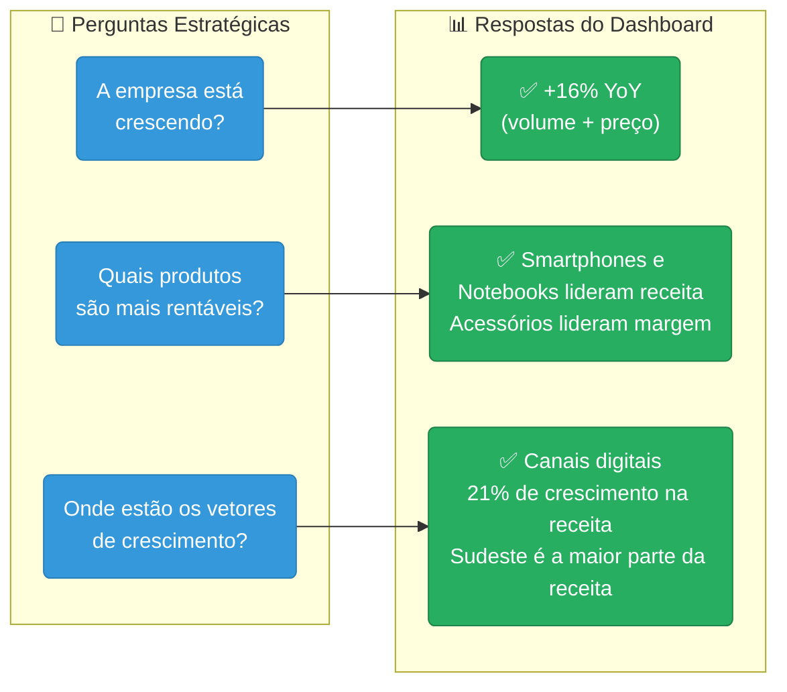

### KPIs Consolidados


| KPI                       | 2025           | 2026           | Variação    |
|---------------------------|----------------|----------------|-------------|
| Total de Vendas           | ~485           | ~515           | +6%         |
| Receita Líquida           | ~R$ 1,22M      | ~R$ 1,42M      | +16%        |
| Ticket Médio              | ~R$ 2,5K       | ~R$ 2,7K       | +9%         |
| Margem Bruta Média        | ~32%           | ~35%           | ↑ +3 p.p.   |

---

## 2. Análise Temporal — Sazonalidade e Crescimento

### 2.1 Padrão Sazonal

O setor de eletroeletrônicos apresenta sazonalidade pronunciada, com picos em datas comemorativas e alta concentração em Novembro/Dezembro:

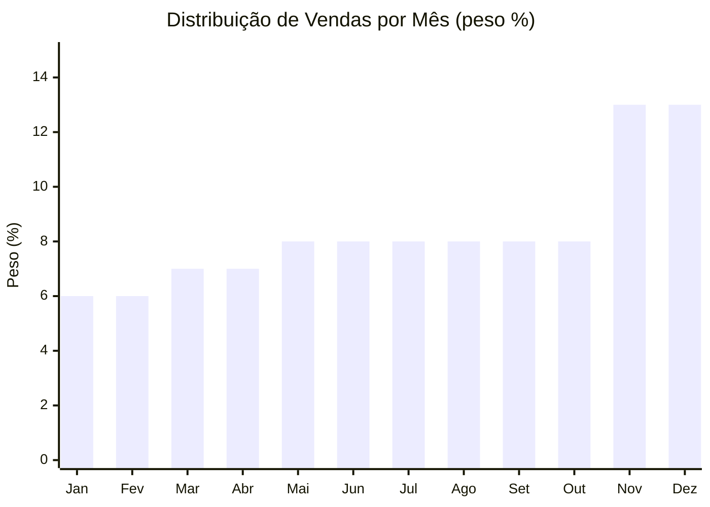

**Janeiro e Fevereiro** são os meses de menor volume (efeito pós-festas + comprometimento de renda com início de ano). São períodos ideais para revisão de estoque e planejamento de promoções.

### 2.2 Composição do Crescimento YoY

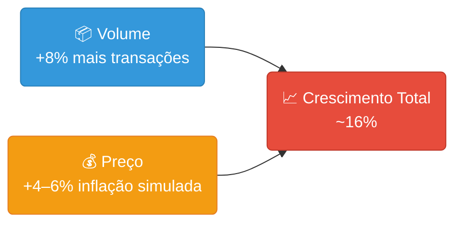

> **Insight importante:** Ao analisar crescimento YoY, é essencial separar **crescimento real (volume)** de **crescimento nominal (preço)**. Sem essa distinção, podemos superestimar a saúde do negócio se o aumento de receita for apenas efeito de inflação.

### 2.3 Visuais no Dashboard

| Visual                          | Tipo              | Configuração                                                 |
|---------------------------------|-------------------|--------------------------------------------------------------|
| Receita Mensal 2025 vs 2026     | Gráfico de Linhas | Eixo X: MesAbrev                                             |
| Crescimento YoY %               | Cartão KPI        | Medida com `SAMEPERIODLASTYEAR` + seta condicional           |
| Evolução Top 5 Vendedores       | Gráfico de Linhas | Medida `RANKX + ALLSELECTED` para filtrar de forma dinâmica  |

---

## 3. Análise de Produtos e Categorias

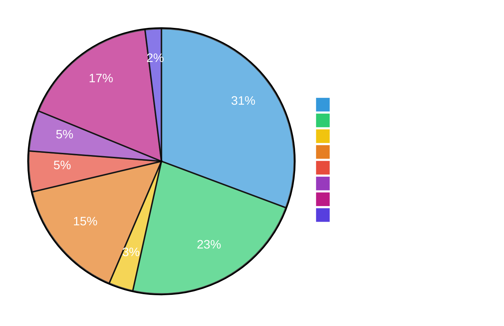

---

## 4. Análise Geográfica — Lojas e Regiões

### 4.1 Distribuição por Região

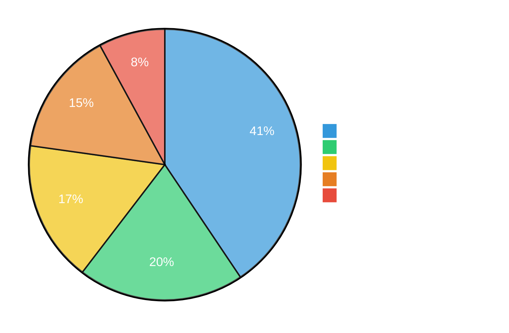

### 4.2 Análise de Concentração Geográfica

A medida `Concentracao Top Estado %` foi criada para avaliar o **risco de dependência** de um único estado:

| Nível de Concentração | % do Top Estado | Interpretação                        |
|-----------------------|:---------------:|--------------------------------------|
| Bem distribuída       | < 20%           | ✅ Baixo risco                       |
| Moderada              | 20–40%          | 🟡 Monitorar                         |
| Alta                  | > 40%           | 🔴 Alto risco de dependência         |

**No nosso dashboard:** SP representa ~18% da receita → empresa tem boa distribuição ✅

> **Por que isso importa?** Se uma empresa depende +50% de um único estado, uma crise econômica local pode derrubar metade do faturamento. Diversificar geograficamente é uma estratégia de mitigação de risco.

---

## 5. Análise de Canais de Venda

### 5.1 Evolução do Canal Físico vs Digital

```mermaid
%%{init: {"themeVariables": {"xyChart": {"plotColorPalette": "#3498db,#27ae60"}}}}%%
xychart-beta
    title "Participação dos Canais de Venda (%)"
    x-axis ["Loja Física", "Site", "Marketplace", "WhatsApp"]
    y-axis "Participação (%)" 0 --> 50
    bar [41, 25, 16, 18]
    bar [38, 29, 19, 14]
```

> 🟦 = 2025 | 🟩 = 2026

| Canal       | 2025  | 2026  | Variação  | Tendência |
|-------------|:-----:|:-----:|:---------:|:---------:|
| Loja Física | 41%   | 38%   | -3 p.p.   | ↓         |
| Site        | 25%   | 29%   | +4 p.p.   | ↑         |
| Marketplace | 16%   | 19%   | +3 p.p.   | ↑         |
| WhatsApp    | 18%   | 14%   | -4 p.p.   | ↓         |
| **Digital** | **59%**| **62%**| **+3 p.p.**| **↑**  |

> **Insight:** Os canais digitais (Website, Marketplace, WhatsApp) estão crescendo, enquanto o canal físico está em queda. Isso reflete a tendência global de migração para o digital, mas também destaca a necessidade de investir em experiência online e logística para capturar esse crescimento. O canal do **WhatsApp** é um caso interessante — apesar de ser um canal digital, sua participação caiu, possivelmente devido à preferência por compras autônomas no site ou marketplace, mas os outros canais digitais compensaram essa queda.

### 5.2 Implicações Estratégicas

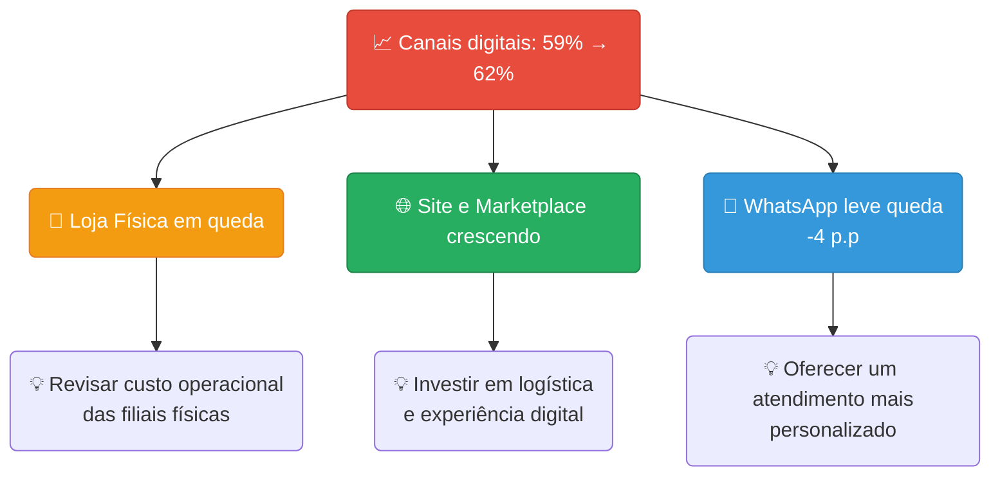

---

## 6. Análise de Formas de Pagamento

### 6.1 Distribuição

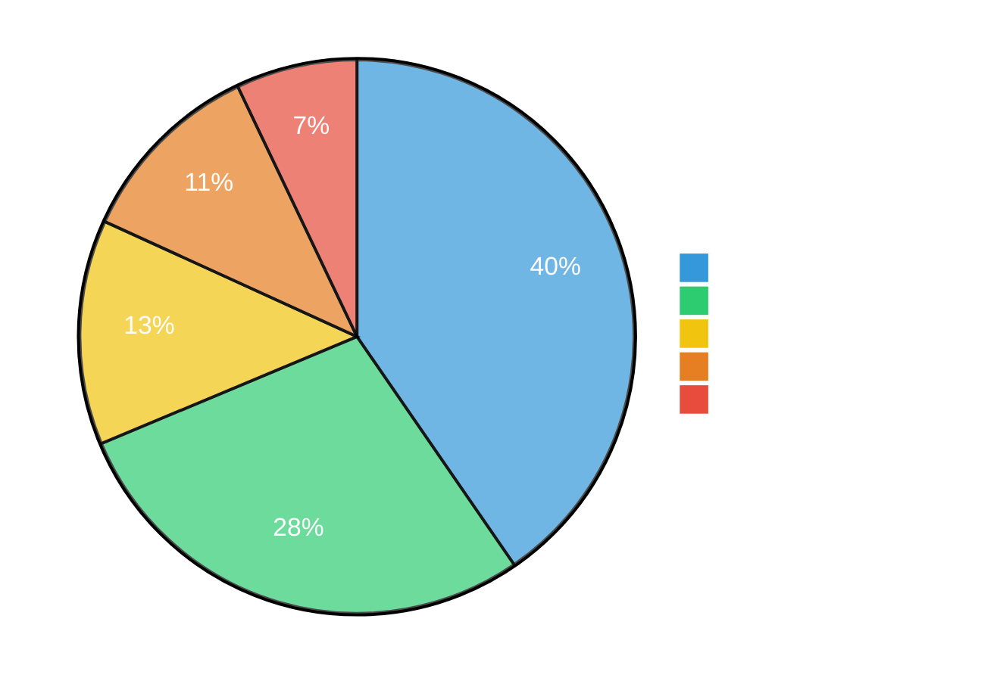

| Método         | Participação | Perfil de Compra                                |
|----------------|:------------:|-------------------------------------------------|
| PIX            | ~40%         | Compras digitais, desconto à vista              |
| Cartão Crédito | ~28%         | Parcelamento — alto ticket (smartphones, notebooks) |
| Cartão Débito  | ~13%         | Compras presenciais de menor valor              |
| Boleto         | ~11%         | Compras B2B e clientes sem cartão               |
| Dinheiro       | ~7%          | **Exclusivo de loja física**                    |

### 6.2 Regra de Negócio Validável

Cruzando `payment_method = 'dinheiro'` com `sales_channel`:
- 100% das vendas em dinheiro devem vir de `loja_fisica`
- Se alguma venda em dinheiro vier de `site` ou `marketplace` → **erro de dados**

```sql
-- Query de validação
SELECT sales_channel, COUNT(*)
FROM sales
WHERE payment_method = 'dinheiro'
GROUP BY sales_channel;
-- Esperado: apenas loja_fisica
```

---

## 7. Análise de Performance da Equipe

### 7.1 Estrutura da Equipe

| Cargo      | Qtd | % Total | Papel                                       |
|------------|:---:|:-------:|---------------------------------------------|
| Vendedor   | 20  | 66,7%   | Linha de frente — principal gerador de receita |
| Gerente    | 7   | 23,3%   | Gestão da loja, pode realizar vendas        |
| Supervisor | 3   | 10,0%   | Supervisiona múltiplas frentes              |

### 7.2 Análise de Perfil via Scatter Plot

O gráfico de dispersão **Quantidade de Vendas vs Ticket Médio** classifica cada vendedor em um dos 4 perfis:

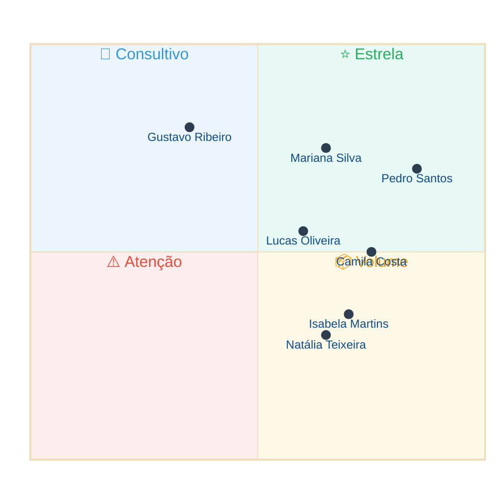

**Ação por quadrante:**

| Quadrante      | Perfil                     | Ação do Gestor                               |
|----------------|----------------------------|----------------------------------------------|
| ⭐ Estrela     | Muitas vendas + ticket alto | Bonificar, usar como mentor                |
| 🎯 Consultivo  | Poucas vendas + ticket alto | Treinar para aumentar volume               |
| 📦 Volume      | Muitas vendas + ticket baixo| Treinar para upsell (vender mais caro)     |
| ⚠️ Atenção     | Poucas vendas + ticket baixo| Necessita de acompanhamento e treinamento  |

> **Configuração no Power BI:**
> - Eixo X: `[Num Vendas]`
> - Eixo Y: `[Ticket Medio]`
> - Tamanho da bolha: `[Receita Liquida]`
> - Cor (Legenda): `employees[role]` (Vendedor/Gerente/Supervisor)
> - Detalhes: `employees[full_name]`
> - Linhas de referência: `[Media Global Num Vendas]` e `[Media Global Ticket Medio]` via Analytics

### 7.3 Evolução Mensal — Top 5 Vendedores

O gráfico de linhas mostra a evolução mensal dos 5 melhores vendedores, respondendo perguntas como:
- *"O melhor vendedor sempre foi bom ou cresceu recentemente?"*
- *"Algum vendedor está em tendência de queda?"*
- *"Tem sazonalidade no desempenho individual?"*

**Modelagem:** Filtrar o gráfico para mostrar apenas 5 vendedores usando `RANKX + ALLSELECTED` (ver [Seção 10](#10-desafios-técnicos-e-soluções)).

---

## 8. Análise Financeira — Margem e Descontos

### 8.1 Estrutura da Receita

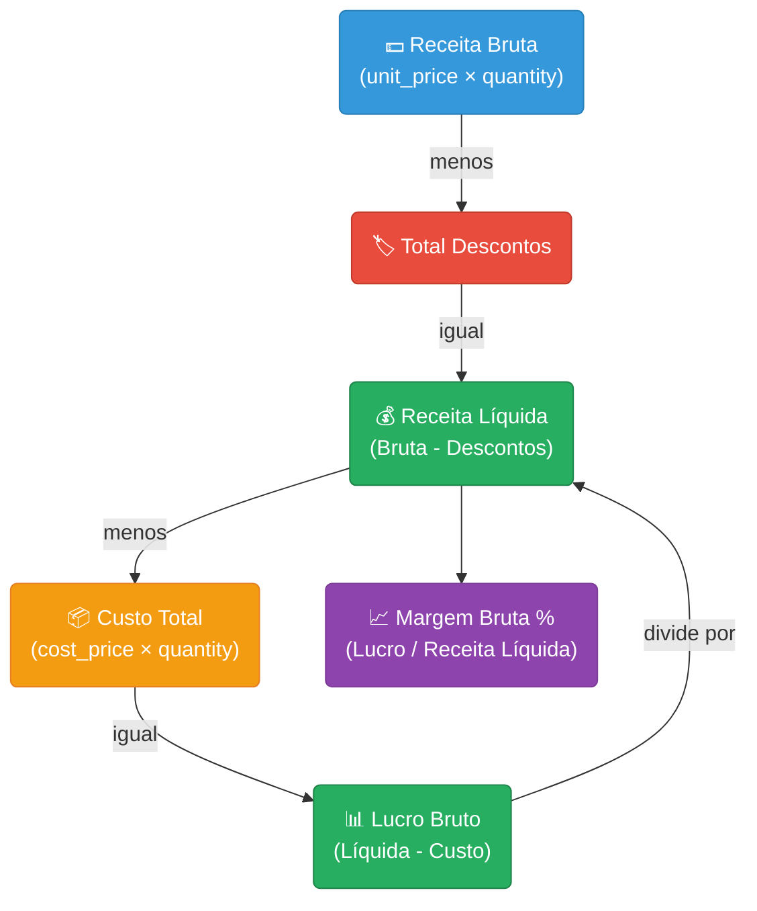

### 8.2 Impacto dos Descontos por Período

| Período                  | Desconto médio (com desconto) | Impacto na Margem          |
|--------------------------|:-----------------------------:|:--------------------------:|
| Meses normais            | 2–6%                          | Mínimo                     |
| Datas comemorativas      | 2–10%                         | Leve compressão            |
| **Black Friday / Natal** | 3–15%                         | **Reduz margem ~3–5 p.p.** |


### 8.3 Efeito do Reajuste de Preços 2026

O script SQL aplica reajuste de +4% a +6% nos preços de 2026, mas o custo permanece o mesmo:

**Resultado:** margem bruta tende a ser **ligeiramente maior em 2026** do que em 2025. Isso é importante para não confundir melhoria de margem com eficiência operacional — é apenas efeito de reajuste de preço, não de redução de custos ou melhora operacional.

---

## 9. Perguntas de Negócio Respondidas

| #  | Pergunta                                                           | Página        | Visual                         |
|----|--------------------------------------------------------------------|---------------|--------------------------------|
| 1  | Qual foi a receita total do período?                               | Executiva     | Card KPI                       |
| 2  | A empresa cresceu em relação ao ano passado?                       | Executiva     | Card YoY % com seta            |
| 3  | Qual mês teve a maior receita?                                     | Executiva     | Gráfico de Linhas              |
| 4  | Quais produtos mais contribuem para a receita?                     | Executiva     | Barras Horizontais (Top 10)    |
| 5  | Qual categoria tem a maior receita?                                | Executiva     | Donut                          |
| 6  | Qual região/filial mais vende?                                     | Regional      | Mapa + Barras                  |
| 7  | A receita está concentrada em poucos estados?                      | Regional      | Card Concentração %            |
| 8  | Qual canal de venda é mais eficiente?                              | Regional      | Barras Empilhadas              |
| 9  | Os canais digitais estão crescendo?                                | Regional      | Comparativo 2025 vs 2026       |
| 10 | Qual é a forma de pagamento mais usada?                            | Equipe        | Donut                          |
| 11 | Quem são os melhores vendedores?                                   | Equipe        | Barras Horizontais             |
| 12 | Qual o ticket médio?                                               | Equipe        | Card KPI                       |
| 13 | Qual o perfil de cada vendedor (volume vs ticket)?                 | Equipe        | Scatter Plot com quadrantes    |
| 14 | Os melhores vendedores são consistentes ao longo do ano?           | Equipe        | Linhas — Top 5 Vendedores      |
| 15 | Qual a margem de lucro por estado?                                 | Regional      | Tabela com formatação cond.    |

---

## 10. Desafios Técnicos e Soluções

Durante o desenvolvimento do dashboard, foi enfrentado diversos desafios técnicos. Cada solução envolveu conceitos importantes de medidas DAX e modelagem:

### 10.1 Relacionamento DateTime vs Date

| Desafio | A coluna `sale_date` é `TIMESTAMP` (com hora), mas `dCalendario[Data]` é `DATE`. |
|---------|-----|
| **Causa** | `01/07/2025 14:30:00 ≠ 01/07/2025` — tipos incompatíveis |
| **Solução** | modificar a coluna `sale_date` para somente a data |
| **Conceito** | Tipagem de dados, integridade de relacionamentos |


---

### 10.2 Ordenação Alfabética dos Meses

| Desafio | O Eixo X do gráfico de linhas mostrava "abr, ago, dez, fev, jan..." (alfabético) em vez de "jan, fev, mar..." (cronológico) |
|---------|-----|
| **Causa** | Power BI ordena colunas de texto alfabeticamente por padrão |
| **Solução** | Classificar coluna `MesAbrev` por `MesNumero` |
| **Conceito** | Sort by Column no Power BI |

```
Ferramentas de Coluna → Classificar por Coluna → MesNumero
```

---

### 10.3 Top 5 Vendedores — Ranking Dinâmico

| Desafio | O gráfico de evolução mensal deveria mostrar apenas 5 vendedores, mas acaba mostrando todos os 30 |
|---------|-----|
| **Causa raiz** | O `RANKX` calculava o ranking no contexto do MÊS (Eixo X), gerando um Top 5 diferente para cada mês. |
| **Resultado** | Quase todos os vendedores apareciam (Top 5 de Jan ≠ Top 5 de Fev ≠ ...) |
| **Solução** | Usar `ALLSELECTED(dCalendario)` dentro do `RANKX` para calcular o ranking de forma GLOBAL. |

```dax
-- ❌ ANTES (ranking muda por mês = gráfico poluído):
RANKX(ALL(employees[full_name]), [Receita Liquida], , DESC, DENSE)

-- ✅ DEPOIS (ranking global fixo = gráfico limpo):
RANKX(
    ALL(employees[full_name]),
    CALCULATE([Receita Liquida], ALLSELECTED(dCalendario)),
    , DESC, DENSE
)
```

**Diferença conceitual:**

| Função          | O que remove                        | O que mantém                           |
|-----------------|-------------------------------------|----------------------------------------|
| `ALL`           | **Todos** os filtros da tabela      | Nada (ignora tudo)                     |
| `ALLSELECTED`   | Filtros **internos** do visual      | Filtros **externos** (slicers)         |

> Com `ALLSELECTED`, se o usuário filtrar "2026" no slicer, o Top 5 recalcula para mostrar os melhores de 2026 apenas. Com `ALL`, o ranking seria sempre baseado em 2025+2026.

---

### 10.4 Medidas de Texto para Cards

| Desafio | Cards KPI como "Melhor Vendedor" e "Estado Top" precisam exibir TEXTO, não números |
|---------|-----|
| **Causa** | Cards nativos do Power BI esperam medidas. Medidas DAX retornam normalmente números. |
| **Solução** | Técnica `ADDCOLUMNS → TOPN → MAXX` para criar tabela virtual e extrair texto |

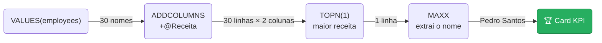

---

### 10.5 Linhas de Referência no Scatter Plot

| Desafio | Medidas existentes (`Media Vendas por Funcionario`) mudavam de valor em cada ponto do scatter |
|---------|-----|
| **Causa** | Dentro do scatter, cada ponto filtra por 1 vendedor. A medida recalculava no contexto individual |
| **Solução** | Criar medidas com `ALL()` para ignorar o contexto do visual e manter valor fixo |
| **Conceito** | `ALL` como modificador de filtro dentro de `AVERAGEX`, medidas para linhas de referência |

```dax
-- Medida para cards (muda com contexto) — NÃO serve para linha de referência:
Media Vendas por Funcionario = DIVIDE([Num Vendas], DISTINCTCOUNT(sales[employee_id]), 0)

-- Medida para linha de referência (valor fixo):
Media Global Num Vendas = AVERAGEX(ALL(employees[full_name]), [Num Vendas])
```

---

### Resumo dos Conceitos Aprendidos

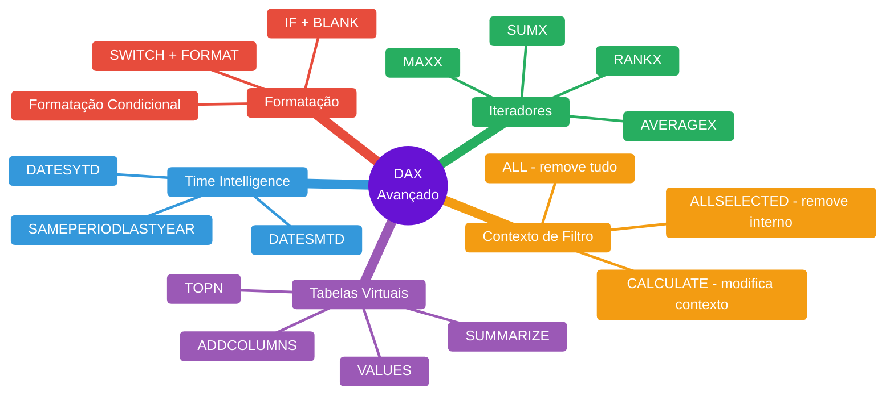

---

← [Voltar ao README](../README.md)