# 📊 Análises e Insights — Sales Analytics

> Interpretação dos dados, análises de negócio por dimensão, principais descobertas do dashboard e desafios técnicos resolvidos durante o desenvolvimento.

---

## Índice

1. [Visão Executiva](#1-visão-executiva)
2. [Análise Temporal — Sazonalidade e Crescimento](#2-análise-temporal--sazonalidade-e-crescimento)
3. [Análise de Produtos e Categorias](#3-análise-de-produtos-e-categorias)
4. [Análise Geográfica — Lojas e Regiões](#4-análise-geográfica--lojas-e-regiões)
5. [Análise de Canais de Venda](#5-análise-de-canais-de-venda)
6. [Análise de Formas de Pagamento](#6-análise-de-formas-de-pagamento)
7. [Análise de Performance da Equipe](#7-análise-de-performance-da-equipe)
8. [Análise Financeira — Margem e Descontos](#8-análise-financeira--margem-e-descontos)
9. [Perguntas de Negócio Respondidas](#9-perguntas-de-negócio-respondidas)
10. [Desafios Técnicos e Soluções](#10-desafios-técnicos-e-soluções)

---

## 1. Visão Executiva

O dashboard responde a três perguntas estratégicas centrais:

1. **A empresa está crescendo?** → Sim. 2026 cresce ~16% em receita sobre 2025 (combinação de +8% volume e +4–6% inflação simulada).
2. **Quais são os produtos/canais mais rentáveis?** → Smartphones e Notebooks lideram receita; Acessórios e Armazenamento têm as maiores margens.
3. **Onde estão os maiores vetores de crescimento?** → Sudeste domina volume, mas canais digitais crescem em todas as regiões.

```mermaid
flowchart LR
    subgraph "🎯 Perguntas Estratégicas"
        P1["A empresa está<br/>crescendo?"]
        P2["Quais produtos/canais<br/>são mais rentáveis?"]
        P3["Onde estão os vetores<br/>de crescimento?"]
    end

    subgraph "📊 Respostas do Dashboard"
        R1["✅ +16% YoY<br/>(volume + preço)"]
        R2["✅ Smartphones e<br/>Notebooks lideram receita<br/>Acessórios lideram margem"]
        R3["✅ Canais digitais<br/>58% → 65%"]
    end

    P1 --> R1
    P2 --> R2
    P3 --> R3

    style P1 fill:#3498db,stroke:#2980b9,color:#fff
    style P2 fill:#3498db,stroke:#2980b9,color:#fff
    style P3 fill:#3498db,stroke:#2980b9,color:#fff
    style R1 fill:#27ae60,stroke:#1e8449,color:#fff
    style R2 fill:#27ae60,stroke:#1e8449,color:#fff
    style R3 fill:#27ae60,stroke:#1e8449,color:#fff
```



### KPIs Consolidados

| KPI                       | 2025           | 2026           | Variação    |
|---------------------------|----------------|----------------|-------------|
| Total de Vendas           | ~480           | ~520           | +8%         |
| Receita Líquida           | ~R$ 1,22M      | ~R$ 1,42M      | +16%        |
| Ticket Médio              | ~R$ 2,5K       | ~R$ 2,7K       | ↑ (+inflação)|
| % Canal Digital           | ~58%           | ~65%           | ↑ +7 p.p.  |
| Margem Bruta Média        | ~33%           | ~34%           | ↑ (+preço sem ↑custo) |

---

## 2. Análise Temporal — Sazonalidade e Crescimento

### 2.1 Padrão Sazonal

O setor de eletroeletrônicos apresenta sazonalidade pronunciada, com picos em datas comemorativas e alta concentração em Novembro/Dezembro:


**Picos de vendas identificados:**

| Mês       | Evento              | Impacto                                   |
|-----------|---------------------|-------------------------------------------|
| Maio      | Dia das Mães        | +10–15% vs meses adjacentes               |
| Junho     | Dia dos Namorados   | +10% — fones, acessórios, smartphones     |
| Agosto    | Dia dos Pais        | +10% — eletrônicos premium                |
| Outubro   | Dia das Crianças    | +10% — tablets, fones, gadgets            |
| Novembro  | **Black Friday**    | **+80–100%** vs média mensal              |
| Dezembro  | **Natal**           | **+80–100%** vs média mensal              |

**Janeiro e Fevereiro** são os meses de menor volume (efeito pós-festas + comprometimento de renda com início de ano). São períodos ideais para revisão de estoque e planejamento de promoções.

### 2.2 Composição do Crescimento YoY

```mermaid
flowchart LR
    TOTAL["📈 Crescimento Total<br/>~16%"]
    VOL["📦 Volume<br/>+8% mais transações"]
    PRECO["💰 Preço<br/>+4–6% inflação simulada"]

    VOL --> TOTAL
    PRECO --> TOTAL

    style TOTAL fill:#e74c3c,stroke:#c0392b,color:#fff
    style VOL fill:#3498db,stroke:#2980b9,color:#fff
    style PRECO fill:#f39c12,stroke:#e67e22,color:#fff
```



> **Insight importante:** Ao analisar crescimento YoY, é essencial separar **crescimento real (volume)** de **crescimento nominal (preço)**. Sem essa distinção, o analista pode superestimar o desempenho da empresa.

### 2.3 Visuais no Dashboard

| Visual                          | Tipo              | Configuração                                        |
|---------------------------------|-------------------|-----------------------------------------------------|
| Receita Mensal 2025 vs 2026     | Gráfico de Linhas | Eixo X: MesAbrev, Legenda: Ano                     |
| Crescimento YoY %               | Cartão KPI        | Medida com `SAMEPERIODLASTYEAR` + seta condicional |
| Evolução Top 5 Vendedores       | Gráfico de Linhas | Medida `RANKX + ALLSELECTED` para filtrar dinâmico |

---

## 3. Análise de Produtos e Categorias

### 3.1 Participação por Categoria na Receita

```mermaid
pie title Distribuição de Receita por Categoria
    "Smartphones" : 25
    "Notebooks e Laptops" : 20
    "Acessórios e Periféricos" : 12
    "Televisores" : 12
    "Áudio e Fones" : 10
    "Eletrodomésticos" : 9
    "Computadores Desktop" : 7
    "Armazenamento" : 5
```



### 3.2 Matriz Volume × Margem por Categoria


**Interpretação dos quadrantes:**

| Quadrante       | Categorias                | Estratégia                                      |
|-----------------|---------------------------|-------------------------------------------------|
| ⭐ Estrela     | Acessórios, Armazenamento | Alto volume E alta margem — **maximizar**       |
| 💰 Margem Alta | Áudio e Fones             | Boa margem, aumentar volume                     |
| 📦 Volume      | Smartphones, Notebooks    | Alto volume, margem menor — **atrair clientes** |
| ⚠️ Revisar     | Desktop, Eletrodomésticos | Baixo volume e margem — reavaliar mix           |

**Insight estratégico:** Produtos de alto ticket (smartphones, notebooks) servem como **âncora** para atrair clientes. Acessórios e periféricos maximizam a margem por venda. A combinação de ambos é a estratégia ótima.

### 3.3 Destaques de Margem

| Produto                       | Preço (R$) | Custo (R$) | Margem  | Categoria     |
|-------------------------------|:----------:|:----------:|:-------:|---------------|
| Cabo HDMI 2.1                 | 49,90      | 18,00      | **63,9%** | Acessórios  |
| Pen Drive Kingston 64GB       | 39,90      | 15,00      | **62,4%** | Armazenamento|
| Mouse Pad Gamer               | 79,90      | 30,00      | **62,5%** | Acessórios  |
| MacBook Air M2                | 8.999      | 6.500      | 27,8%   | Notebooks     |
| Notebook Dell Inspiron        | 2.599      | 1.900      | 26,9%   | Notebooks     |

> O MacBook Air M2 tem margem de apenas 27,8%, enquanto um Cabo HDMI tem 63,9%. Mas o MacBook gera R$ 2.499 de lucro bruto por unidade vs R$ 31,90 do cabo. **Margem percentual e lucro absoluto são métricas complementares**.

---

## 4. Análise Geográfica — Lojas e Regiões

### 4.1 Distribuição por Região

```mermaid
pie title Participação na Receita por Região
    "Sudeste (SP, RJ, MG)" : 45
    "Sul (PR, RS)" : 17
    "Nordeste (PE, BA)" : 16
    "Centro-Oeste (DF, GO)" : 14
    "Norte (AM)" : 8
```



A distribuição segue o **PIB regional brasileiro**, o que torna os dados realistas para análise.

### 4.2 Análise de Concentração Geográfica

A medida `Concentracao Top Estado %` foi criada para avaliar o **risco de dependência** de um único estado:

| Nível de Concentração | % do Top Estado | Interpretação                        |
|-----------------------|:---------------:|--------------------------------------|
| Bem distribuída       | < 20%           | ✅ Baixo risco                       |
| Moderada              | 20–40%          | 🟡 Monitorar                         |
| Alta                  | > 40%           | 🔴 Alto risco de dependência         |

**No nosso dashboard:** SP representa ~18% da receita → empresa tem boa distribuição ✅

> **Por que isso importa?** Se uma empresa depende 50%+ de um único estado, uma crise econômica local pode derrubar metade do faturamento. Essa análise demonstra **pensamento estratégico** e é valorizada em entrevistas.

### 4.3 Visuais no Dashboard

| Visual                         | Tipo                     | Insight                                   |
|--------------------------------|--------------------------|-------------------------------------------|
| Receita por Estado             | Barras Horizontais       | Ranking de faturamento por UF             |
| Mapa do Brasil                 | Mapa/Filled Map          | Distribuição geográfica visual            |
| Tabela com formatação cond.    | Tabela                   | Margem % com cores (🟢🟡🔴)              |
| Receita por Canal (2025 vs 2026)| Barras Empilhadas       | Evolução digital por canal                |

---

## 5. Análise de Canais de Venda

### 5.1 Evolução do Canal Físico vs Digital


> 🟦 = 2025 | 🟧 = 2026

| Canal       | 2025  | 2026  | Variação  | Tendência |
|-------------|:-----:|:-----:|:---------:|:---------:|
| Loja Física | 42%   | 35%   | -7 p.p.   | ↓         |
| Site        | 26%   | 30%   | +4 p.p.   | ↑         |
| Marketplace | 16%   | 20%   | +4 p.p.   | ↑         |
| WhatsApp    | 16%   | 15%   | -1 p.p.   | →         |
| **Digital** | **58%**| **65%**| **+7 p.p.**| **↑**  |

### 5.2 Implicações Estratégicas

```mermaid
flowchart TD
    TENDENCIA["📈 Canais digitais: 58% → 65%"]

    TENDENCIA --> A["🏪 Loja Física em queda"]
    TENDENCIA --> B["🌐 Site e Marketplace crescendo"]
    TENDENCIA --> C["📱 WhatsApp estável"]

    A --> A1["💡 Revisar custo operacional<br/>das filiais físicas"]
    B --> B1["💡 Investir em logística<br/>e experiência digital"]
    C --> C1["💡 Manter atendimento<br/>personalizado"]

    style TENDENCIA fill:#e74c3c,stroke:#c0392b,color:#fff
    style A fill:#f39c12,stroke:#e67e22,color:#fff
    style B fill:#27ae60,stroke:#1e8449,color:#fff
    style C fill:#3498db,stroke:#2980b9,color:#fff
```



### 5.3 Ticket Médio por Canal

Tipicamente:

| Canal          | Ticket Médio   | Motivo                                      |
|----------------|:--------------:|---------------------------------------------|
| Loja Física    | **Mais alto**  | Consultor presencial guia compras maiores   |
| WhatsApp       | Alto           | Atendimento personalizado, upsell           |
| Site           | Médio          | Navegação autônoma                          |
| Marketplace    | **Mais baixo** | Compradores focados em preço                |

---

## 6. Análise de Formas de Pagamento

### 6.1 Distribuição

```mermaid
pie title Formas de Pagamento (% das transações)
    "PIX" : 35
    "Cartão de Crédito" : 30
    "Cartão de Débito" : 15
    "Boleto" : 12
    "Dinheiro" : 8
```



| Método         | Participação | Perfil de Compra                                |
|----------------|:------------:|-------------------------------------------------|
| PIX            | ~35%         | Compras digitais, desconto à vista              |
| Cartão Crédito | ~30%         | Parcelamento — alto ticket (smartphones, notebooks) |
| Cartão Débito  | ~15%         | Compras presenciais de menor valor              |
| Boleto         | ~12%         | Compras B2B e clientes sem cartão               |
| Dinheiro       | ~8%          | **Exclusivo de loja física**                    |

### 6.2 Regra de Negócio Validável

Cruzando `payment_method = 'dinheiro'` com `sales_channel`:
- 100% das vendas em dinheiro devem vir de `loja_fisica`
- Se alguma venda em dinheiro vier de `site` ou `marketplace` → **erro de dados**

```sql
-- Query de validação
SELECT sales_channel, COUNT(*)
FROM sales
WHERE payment_method = 'dinheiro'
GROUP BY sales_channel;
-- Esperado: apenas loja_fisica
```

---

## 7. Análise de Performance da Equipe

### 7.1 Estrutura da Equipe

| Cargo      | Qtd | % Total | Papel                                       |
|------------|:---:|:-------:|---------------------------------------------|
| Vendedor   | 20  | 66,7%   | Linha de frente — principal gerador de receita |
| Gerente    | 7   | 23,3%   | Gestão da loja, pode realizar vendas        |
| Supervisor | 3   | 10,0%   | Supervisiona múltiplas frentes              |

### 7.2 Análise de Perfil via Scatter Plot

O gráfico de dispersão **Quantidade de Vendas vs Ticket Médio** classifica cada vendedor em um dos 4 perfis:

```mermaid
quadrantChart
    title Perfil de Vendedores (Volume vs Ticket)
    x-axis "Poucas Vendas" --> "Muitas Vendas"
    y-axis "Ticket Baixo" --> "Ticket Alto"
    quadrant-1 "⭐ Estrela"
    quadrant-2 "🎯 Consultivo"
    quadrant-3 "⚠️ Atenção"
    quadrant-4 "📦 Volume"
    "Pedro Santos": [0.85, 0.70]
    "Mariana Silva": [0.65, 0.75]
    "Camila Costa": [0.75, 0.50]
    "Lucas Oliveira": [0.60, 0.55]
    "Isabela Martins": [0.70, 0.35]
    "Gustavo Ribeiro": [0.35, 0.80]
    "Natália Teixeira": [0.65, 0.30]
```



**Ação por quadrante:**

| Quadrante      | Perfil                     | Ação do Gestor                              |
|----------------|----------------------------|---------------------------------------------|
| ⭐ Estrela     | Muitas vendas + ticket alto | Bonificar, usar como mentor                |
| 🎯 Consultivo  | Poucas vendas + ticket alto | Treinar para aumentar volume               |
| 📦 Volume      | Muitas vendas + ticket baixo| Treinar para upsell (vender mais caro)     |
| ⚠️ Atenção     | Poucas vendas + ticket baixo| Acompanhamento urgente, treinamento        |

> **Configuração no Power BI:**
> - Eixo X: `[Num Vendas]`
> - Eixo Y: `[Ticket Medio]`
> - Tamanho da bolha: `[Receita Liquida]`
> - Cor (Legenda): `employees[role]` (Vendedor/Gerente/Supervisor)
> - Detalhes: `employees[full_name]`
> - Linhas de referência: `[Media Global Num Vendas]` e `[Media Global Ticket Medio]` via Analytics

### 7.3 Evolução Mensal — Top 5 Vendedores

O gráfico de linhas mostra a evolução mensal dos 5 melhores vendedores, respondendo perguntas como:
- *"O melhor vendedor sempre foi bom ou cresceu recentemente?"*
- *"Algum vendedor está em tendência de queda?"*
- *"Tem sazonalidade no desempenho individual?"*

**Desafio técnico resolvido:** Filtrar o gráfico para mostrar apenas 5 vendedores usando `RANKX + ALLSELECTED` (ver [Seção 10](#10-desafios-técnicos-e-soluções)).

### 7.4 Cards KPI da Página

| Card                           | Medida DAX                    | Técnica                               |
|--------------------------------|-------------------------------|---------------------------------------|
| 👥 Total Funcionários          | `COUNTROWS(employees)`        | Contagem simples                      |
| 🏆 Melhor Vendedor (texto)     | `ADDCOLUMNS + TOPN + MAXX`   | Tabela virtual → extração de texto    |
| 💰 Receita por Funcionário     | `DIVIDE + DISTINCTCOUNT`      | Divisão segura                        |
| 📊 Média Vendas/Funcionário    | `DIVIDE + DISTINCTCOUNT`      | Reutilização de medidas (DRY)         |
| 🎟️ Ticket Médio por Vendedor  | `DIVIDE(Receita/Func, Vendas/Func)` | Composição de medidas           |

---

## 8. Análise Financeira — Margem e Descontos

### 8.1 Estrutura da Receita

```mermaid
flowchart TD
    RB["💵 Receita Bruta<br/>(unit_price × quantity)"]
    DESC["🏷️ Total Descontos"]
    RL["💰 Receita Líquida<br/>(Bruta - Descontos)"]
    CT["📦 Custo Total<br/>(cost_price × quantity)"]
    LB["📊 Lucro Bruto<br/>(Líquida - Custo)"]
    MB["📈 Margem Bruta %<br/>(Lucro / Receita Líquida)"]

    RB -->|menos| DESC
    DESC -->|igual| RL
    RL -->|menos| CT
    CT -->|igual| LB
    LB -->|divide por| RL
    RL --> MB

    style RB fill:#3498db,stroke:#2980b9,color:#fff
    style DESC fill:#e74c3c,stroke:#c0392b,color:#fff
    style RL fill:#27ae60,stroke:#1e8449,color:#fff
    style CT fill:#f39c12,stroke:#e67e22,color:#fff
    style LB fill:#27ae60,stroke:#1e8449,color:#fff
    style MB fill:#8e44ad,stroke:#7d3c98,color:#fff
```



### 8.2 Impacto dos Descontos por Período

| Período                  | Sem desconto | Desconto médio (com desconto) | Impacto na Margem |
|--------------------------|:------------:|:-----------------------------:|:------------------:|
| Meses normais            | 55%          | 2–6%                          | Mínimo             |
| Datas comemorativas      | 40%          | 2–10%                         | Leve compressão    |
| **Black Friday / Natal** | 25%          | 3–15%                         | **Reduz margem ~3–5 p.p.** |

### 8.3 Margem por Período

```
Jan–Out:  Margem Bruta ~35–38%
Nov–Dez:  Margem Bruta ~30–34% (descontos mais agressivos)
```

**Análise recomendada:**
- Comparar `Desconto % sobre Receita Bruta` em novembro vs média do ano
- Verificar se o **aumento de volume** em Black Friday compensa a compressão de margem
- Identificar produtos com desconto excessivo

### 8.4 Efeito do Reajuste de Preços 2026

O script SQL aplica reajuste de +4% a +6% nos preços de 2026, mas o custo permanece o mesmo:

```
Preço 2026 = Preço 2025 × 1,05 (média)
Custo 2026 = Custo 2025 (sem alteração)
```

**Resultado:** margem bruta tende a ser **ligeiramente maior em 2026** do que em 2025. Isso é importante para não confundir melhoria de margem com eficiência operacional — é apenas efeito de preço.

---

## 9. Perguntas de Negócio Respondidas

| #  | Pergunta                                                           | Página        | Visual                         |
|----|--------------------------------------------------------------------|---------------|--------------------------------|
| 1  | Qual foi a receita total do período?                               | Executiva     | Card KPI                       |
| 2  | A empresa cresceu em relação ao ano passado?                       | Executiva     | Card YoY % com seta            |
| 3  | Qual mês teve a maior receita?                                     | Executiva     | Gráfico de Linhas              |
| 4  | Quais produtos mais contribuem para a receita?                     | Executiva     | Barras Horizontais (Top 10)    |
| 5  | Qual categoria tem a maior receita?                                | Executiva     | Donut                          |
| 6  | Qual região/filial mais vende?                                     | Regional      | Mapa + Barras                  |
| 7  | A receita está concentrada em poucos estados?                      | Regional      | Card Concentração %            |
| 8  | Qual canal de venda é mais eficiente?                              | Regional      | Barras Empilhadas              |
| 9  | Os canais digitais estão crescendo?                                | Regional      | Comparativo 2025 vs 2026       |
| 10 | Qual é a forma de pagamento mais usada?                            | Equipe        | Donut                          |
| 11 | Quem são os melhores vendedores?                                   | Equipe        | Barras Horizontais             |
| 12 | Qual o ticket médio?                                               | Equipe        | Card KPI                       |
| 13 | Qual o perfil de cada vendedor (volume vs ticket)?                 | Equipe        | Scatter Plot com quadrantes    |
| 14 | Os melhores vendedores são consistentes ao longo do ano?           | Equipe        | Linhas — Top 5 Vendedores      |
| 15 | Qual a margem de lucro por estado?                                 | Regional      | Tabela com formatação cond.    |

---

## 10. Desafios Técnicos e Soluções

Durante o desenvolvimento do dashboard, enfrentamos diversos desafios técnicos. Cada solução envolveu conceitos importantes de DAX e modelagem:

### 10.1 Relacionamento DateTime vs Date

| Desafio | A coluna `sale_date` é `TIMESTAMP` (com hora), mas `dCalendario[Data]` é `DATE`. O relacionamento falhava silenciosamente. |
|---------|-----|
| **Causa** | `01/07/2025 14:30:00 ≠ 01/07/2025` — tipos incompatíveis |
| **Solução** | Criar coluna calculada `sale_date_only` extraindo somente a data |
| **Conceito** | Tipagem de dados, integridade de relacionamentos |

```dax
sale_date_only = DATE(YEAR(sales[sale_date]), MONTH(sales[sale_date]), DAY(sales[sale_date]))
```

---

### 10.2 Ordenação Alfabética dos Meses

| Desafio | O Eixo X do gráfico de linhas mostrava "abr, ago, dez, fev, jan..." (alfabético) em vez de "jan, fev, mar..." (cronológico) |
|---------|-----|
| **Causa** | Power BI ordena colunas de texto alfabeticamente por padrão |
| **Solução** | Classificar coluna `MesAbrev` por `MesNumero` |
| **Conceito** | Sort by Column no Power BI |

```
Ferramentas de Coluna → Classificar por Coluna → MesNumero
```

---

### 10.3 Top 5 Vendedores — Ranking Dinâmico

| Desafio | O gráfico de evolução mensal deveria mostrar apenas 5 vendedores, mas mostrava todos os 30 |
|---------|-----|
| **Causa raiz** | O `RANKX` calculava o ranking no contexto do MÊS (Eixo X), gerando um Top 5 diferente para cada mês |
| **Resultado** | Quase todos os vendedores apareciam (Top 5 de Jan ≠ Top 5 de Fev ≠ ...) |
| **Solução** | Usar `ALLSELECTED(dCalendario)` dentro do `RANKX` para calcular o ranking GLOBAL |
| **Conceito** | Contexto de filtro, `ALL` vs `ALLSELECTED`, `CALCULATE` |

```dax
-- ❌ ANTES (ranking muda por mês = gráfico poluído):
RANKX(ALL(employees[full_name]), [Receita Liquida], , DESC, DENSE)

-- ✅ DEPOIS (ranking global fixo = gráfico limpo):
RANKX(
    ALL(employees[full_name]),
    CALCULATE([Receita Liquida], ALLSELECTED(dCalendario)),
    , DESC, DENSE
)
```

**Diferença conceitual:**

| Função          | O que remove                        | O que mantém                           |
|-----------------|-------------------------------------|----------------------------------------|
| `ALL`           | **Todos** os filtros da tabela      | Nada (ignora tudo)                     |
| `ALLSELECTED`   | Filtros **internos** do visual      | Filtros **externos** (slicers)         |

> Com `ALLSELECTED`, se o usuário filtrar "2026" no slicer, o Top 5 recalcula para mostrar os melhores de 2026 apenas. Com `ALL`, o ranking seria sempre baseado em 2025+2026.

---

### 10.4 Medidas de Texto para Cards

| Desafio | Cards KPI como "Melhor Vendedor" e "Estado Top" precisam exibir TEXTO, não números |
|---------|-----|
| **Causa** | Cards nativos do Power BI esperam medidas. Medidas DAX retornam normalmente números. |
| **Solução** | Técnica `ADDCOLUMNS → TOPN → MAXX` para criar tabela virtual e extrair texto |
| **Conceito** | Tabelas virtuais, funções iteradoras, `VAR/RETURN` |


---

### 10.5 Linhas de Referência no Scatter Plot

| Desafio | Medidas existentes (`Media Vendas por Funcionario`) mudavam de valor em cada ponto do scatter |
|---------|-----|
| **Causa** | Dentro do scatter, cada ponto filtra por 1 vendedor. A medida recalculava no contexto individual. |
| **Solução** | Criar medidas com `ALL()` para ignorar o contexto do visual e manter valor fixo |
| **Conceito** | `ALL` como modificador de filtro dentro de `AVERAGEX`, medidas para linhas de referência |

```dax
-- Medida para cards (muda com contexto) — NÃO serve para linha de referência:
Media Vendas por Funcionario = DIVIDE([Num Vendas], DISTINCTCOUNT(sales[employee_id]), 0)

-- Medida para linha de referência (valor fixo):
Media Global Num Vendas = AVERAGEX(ALL(employees[full_name]), [Num Vendas])
```

---

### 10.6 Card Duplicado — Quantidade de Lojas

| Desafio | Dois cards mostrando "Quantidade de Lojas = 10" (informação repetida) |
|---------|-----|
| **Solução** | Substituir um por `Concentracao Top Estado %` — métrica de risco geográfico |
| **Conceito** | Análise de concentração, pensamento estratégico, `MAXX + ALL + DIVIDE` |

> Essa decisão demonstra **maturidade analítica**: em vez de repetir um dado, criar uma métrica que gera **insight acionável**.

---

### Resumo dos Conceitos Aprendidos

```mermaid
mindmap
  root((DAX<br/>Avançado))
    Contexto de Filtro
      ALL - remove tudo
      ALLSELECTED - remove interno
      CALCULATE - modifica contexto
    Tabelas Virtuais
      ADDCOLUMNS
      VALUES
      TOPN
      SUMMARIZE
    Iteradores
      SUMX
      AVERAGEX
      MAXX
      RANKX
    Time Intelligence
      SAMEPERIODLASTYEAR
      DATESYTD
      DATESMTD
    Formatação
      SWITCH + FORMAT
      IF + BLANK
      Formatação Condicional
```



---

← [Voltar ao README](../README.md)