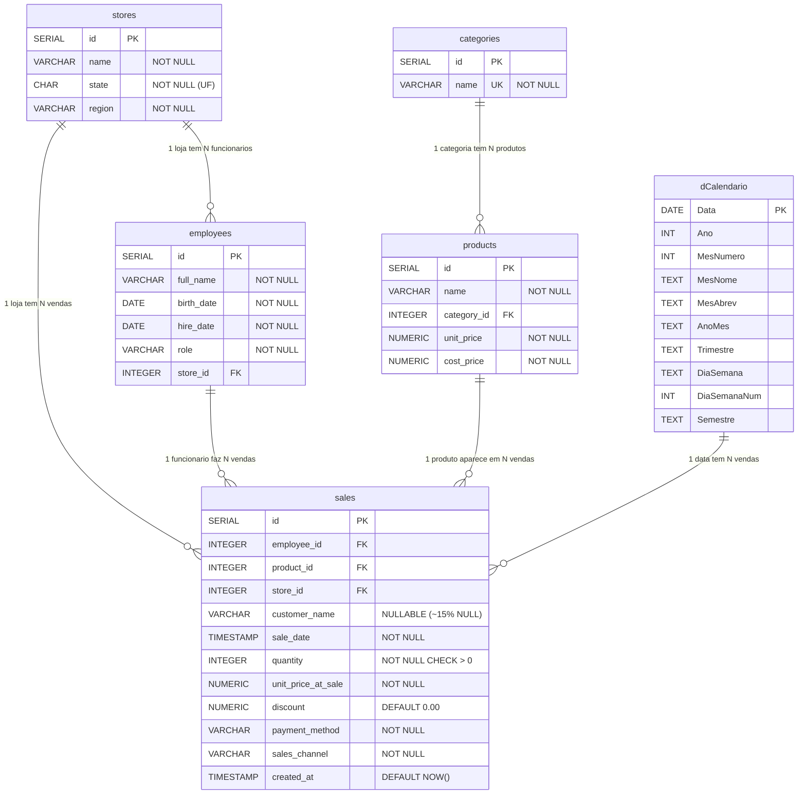
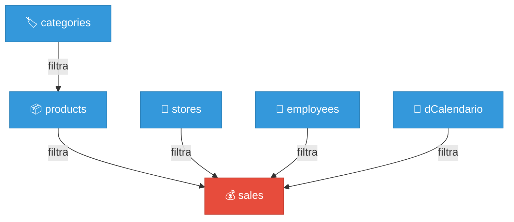
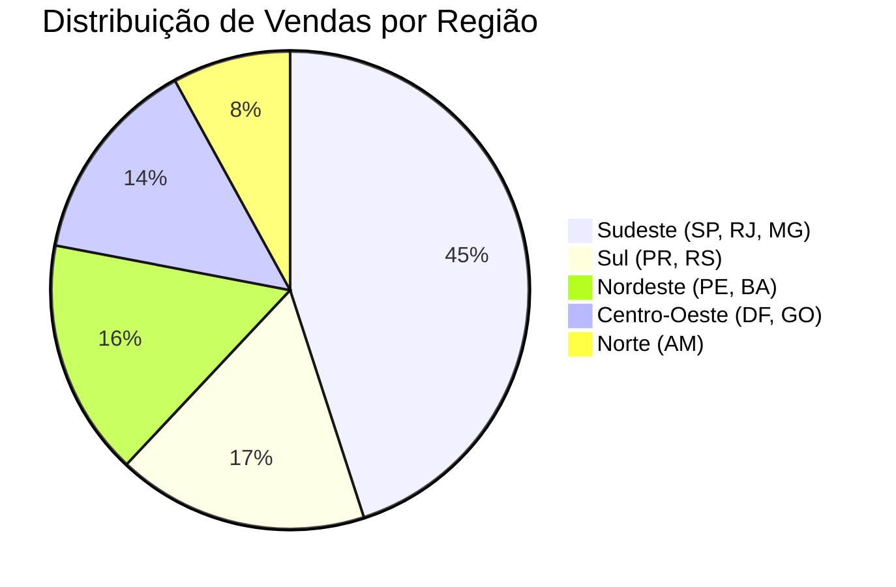
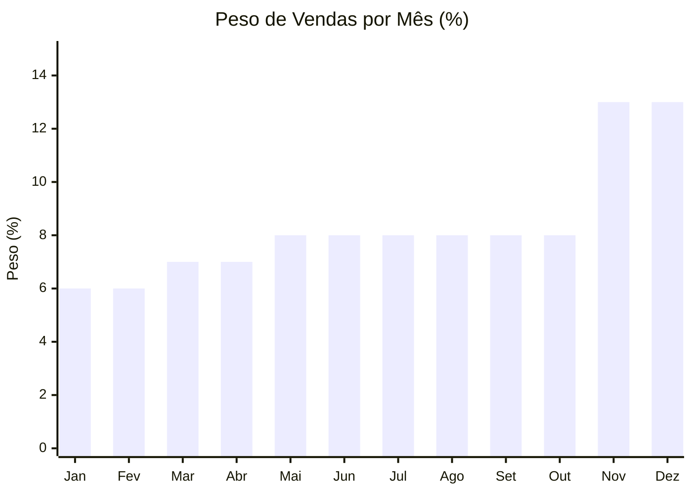

# 🗄️ Banco de Dados — Sales Analytics

> Documentação completa do schema PostgreSQL: tabelas, colunas, tipos, relacionamentos, índices e lógica de geração dos dados.

---

## Índice

1. [Visão Geral do Schema](#1-visão-geral-do-schema)
2. [Diagrama de Relacionamento (ER)](#2-diagrama-de-relacionamento-er)
3. [Dicionário de Dados](#3-dicionário-de-dados)
   - [categories](#31-categories)
   - [stores](#32-stores)
   - [employees](#33-employees)
   - [products](#34-products)
   - [sales](#35-sales)
   - [dCalendario (Power BI)](#36-dcalendario-power-bi)
4. [Índices de Performance](#4-índices-de-performance)
5. [Dados de Dimensão](#5-dados-de-dimensão)
6. [Lógica de Geração das Vendas](#6-lógica-de-geração-das-vendas)
7. [Transformações no Power Query (ETL)](#7-transformações-no-power-query-etl)
8. [Relacionamentos no Power BI](#8-relacionamentos-no-power-bi)
9. [Consultas de Validação](#9-consultas-de-validação)

---

## 1. Visão Geral do Schema

O banco de dados segue uma arquitetura **relacional normalizada** que se mapeia diretamente para um **Star Schema** (Esquema Estrela) no Power BI.

No Star Schema:
- A tabela **fato** (`sales`) armazena os eventos de negócio (transações de venda)
- As tabelas **dimensão** (`products`, `categories`, `stores`, `employees`, `dCalendario`) descrevem os atributos das entidades envolvidas
- Os **filtros fluem das dimensões para o fato** (propagação unidirecional)

| Tabela        | Linhas | Papel no Star Schema | Descrição                         |
|---------------|--------|----------------------|-----------------------------------|
| `categories`  | 8      | Dimensão             | Categorias de produtos            |
| `stores`      | 10     | Dimensão             | Filiais com estado e região       |
| `employees`   | 30     | Dimensão             | Funcionários com cargo            |
| `products`    | 40     | Dimensão             | Produtos com preço e custo        |
| `sales`       | 1.000  | **Fato (central)**   | Registros de venda                |
| `dCalendario` | 731    | Dimensão (Power BI)  | Tabela calendário para Time Intel |

---

## 2. Diagrama de Relacionamento (ER)



### Leitura do Diagrama

| Símbolo | Significado |
|---------|-------------|
| `PK`    | Primary Key (chave primária) |
| `FK`    | Foreign Key (chave estrangeira) |
| `UK`    | Unique (valor único) |
| `\|\|--o{` | Relacionamento 1:N (um para muitos) |

### Fluxo de Filtros no Star Schema



> 🔵 **Azul** = Dimensões (filtram) → 🔴 **Vermelho** = Fato (é filtrada)
>
> Os filtros **sempre fluem das dimensões para o fato**, nunca ao contrário. Isso é garantido pela configuração de **filtro cruzado unidirecional** ("Único") em todos os relacionamentos no Power BI.

---

## 3. Dicionário de Dados

### 3.1 `categories`

Tabela de categorias de produtos. Todas as 8 categorias pertencem ao segmento de eletroeletrônicos.

| Coluna | Tipo           | Restrições             | Descrição                    |
|--------|----------------|------------------------|------------------------------|
| `id`   | `SERIAL`       | `PRIMARY KEY`          | Identificador sequencial     |
| `name` | `VARCHAR(100)` | `NOT NULL`, `UNIQUE`   | Nome da categoria            |

**Categorias cadastradas:**

| id | Categoria                  | Qtd Produtos | Faixa de Preço (R$)  |
|----|----------------------------|:------------:|-----------------------|
| 1  | Smartphones                | 5            | 999 – 5.999           |
| 2  | Notebooks e Laptops        | 5            | 2.599 – 8.999         |
| 3  | Computadores Desktop       | 3            | 2.199 – 5.499         |
| 4  | Televisores                | 4            | 1.699 – 4.999         |
| 5  | Eletrodomésticos           | 6            | 189 – 3.799           |
| 6  | Áudio e Fones              | 5            | 219 – 1.899           |
| 7  | Acessórios e Periféricos   | 7            | 49,90 – 549           |
| 8  | Armazenamento              | 5            | 39,90 – 549           |

---

### 3.2 `stores`

Filiais da empresa. Cobrem as 5 regiões geográficas do Brasil, ponderadas pelo PIB regional.

| Coluna   | Tipo           | Restrições   | Descrição                                          |
|----------|----------------|--------------|----------------------------------------------------|
| `id`     | `SERIAL`       | `PRIMARY KEY`| Identificador sequencial                           |
| `name`   | `VARCHAR(150)` | `NOT NULL`   | Nome da filial                                     |
| `state`  | `CHAR(2)`      | `NOT NULL`   | Sigla do estado (UF)                               |
| `region` | `VARCHAR(20)`  | `NOT NULL`   | Região geográfica                                  |

**Filiais cadastradas:**

| id | Nome                     | UF | Região        | % Vendas (peso PIB) |
|----|--------------------------|:--:|---------------|:--------------------:|
| 1  | Filial Centro SP         | SP | Sudeste       | ~15%                 |
| 2  | Filial Shopping RJ       | RJ | Sudeste       | ~15%                 |
| 3  | Filial Savassi BH        | MG | Sudeste       | ~15%                 |
| 4  | Filial Batel Curitiba    | PR | Sul           | ~9%                  |
| 5  | Filial Moinhos POA       | RS | Sul           | ~8%                  |
| 6  | Filial Recife            | PE | Nordeste      | ~8%                  |
| 7  | Filial Salvador          | BA | Nordeste      | ~8%                  |
| 8  | Filial Brasília          | DF | Centro-Oeste  | ~7%                  |
| 9  | Filial Goiânia           | GO | Centro-Oeste  | ~7%                  |
| 10 | Filial Manaus            | AM | Norte         | ~7%                  |

---

### 3.3 `employees`

30 funcionários distribuídos igualmente (3 por loja), com três cargos possíveis.

| Coluna       | Tipo           | Restrições                     | Descrição                            |
|--------------|----------------|--------------------------------|--------------------------------------|
| `id`         | `SERIAL`       | `PRIMARY KEY`                  | Identificador sequencial             |
| `full_name`  | `VARCHAR(200)` | `NOT NULL`                     | Nome completo                        |
| `birth_date` | `DATE`         | `NOT NULL`                     | Data de nascimento                   |
| `hire_date`  | `DATE`         | `NOT NULL`                     | Data de contratação                  |
| `role`       | `VARCHAR(50)`  | `NOT NULL`                     | Cargo                                |
| `store_id`   | `INTEGER`      | `NOT NULL`, `FK → stores(id)`  | Filial de lotação                    |

**Distribuição de cargos:**

| Cargo       | Quantidade | % do total | Papel no Negócio                          |
|-------------|:----------:|:----------:|-------------------------------------------|
| Vendedor    | 20         | 66,7%      | Linha de frente — principal gerador de receita |
| Gerente     | 7          | 23,3%      | Gestão da loja, pode realizar vendas      |
| Supervisor  | 3          | 10,0%      | Supervisiona múltiplas frentes            |

> Cada loja possui exatamente **3 funcionários**. O `employee_id` de uma venda é sempre da mesma loja (`store_id`) que originou a venda — garantindo integridade lógica.

---

### 3.4 `products`

40 produtos com preços de venda e custo de aquisição baseados no mercado brasileiro de 2025/2026.

| Coluna        | Tipo            | Restrições                        | Descrição                             |
|---------------|-----------------|-----------------------------------|---------------------------------------|
| `id`          | `SERIAL`        | `PRIMARY KEY`                     | Identificador sequencial              |
| `name`        | `VARCHAR(200)`  | `NOT NULL`                        | Nome do produto                       |
| `category_id` | `INTEGER`       | `NOT NULL`, `FK → categories(id)` | Categoria do produto                  |
| `unit_price`  | `NUMERIC(10,2)` | `NOT NULL`                        | Preço de tabela (venda)               |
| `cost_price`  | `NUMERIC(10,2)` | `NOT NULL`                        | Custo de aquisição                    |

> **Por que `NUMERIC(10,2)` e não `FLOAT`?** Valores monetários NUNCA devem usar `FLOAT`/`DOUBLE` porque esses tipos têm erros de arredondamento (ex: `0.1 + 0.2 = 0.30000000000000004`). `NUMERIC` garante precisão exata. Essa é uma pergunta clássica de entrevista.

**Destaques — Produtos com maior e menor margem:**

| Produto                   | Categoria     | Preço (R$) | Custo (R$) | Margem  |
|---------------------------|---------------|:----------:|:----------:|:-------:|
| MacBook Air M2            | Notebooks     | 8.999      | 6.500      | 27,8%   |
| iPhone 15 128GB           | Smartphones   | 5.999      | 4.200      | 30,0%   |
| PC Gamer i5 RTX 3060      | Desktop       | 5.499      | 3.800      | 30,9%   |
| Cabo HDMI 2.1 2m          | Acessórios    | 49,90      | 18,00      | **63,9%** |
| Pen Drive Kingston 64GB   | Armazenamento | 39,90      | 15,00      | **62,4%** |
| Mouse Pad Gamer Grande    | Acessórios    | 79,90      | 30,00      | **62,5%** |

> Produtos de **alto ticket** (>R$ 3.000) são sempre vendidos em quantidade unitária. Produtos de **baixo ticket** (<R$ 100) podem ser vendidos em até 5 unidades por transação.

---

### 3.5 `sales`

Tabela fato central. Cada linha representa uma transação de venda completa.

| Coluna                | Tipo                        | Restrições                       | Descrição                                          |
|-----------------------|-----------------------------|----------------------------------|----------------------------------------------------|
| `id`                  | `SERIAL`                    | `PRIMARY KEY`                    | Identificador da transação                         |
| `employee_id`         | `INTEGER`                   | `NOT NULL`, `FK → employees(id)` | Funcionário que realizou a venda                   |
| `product_id`          | `INTEGER`                   | `NOT NULL`, `FK → products(id)`  | Produto vendido                                    |
| `store_id`            | `INTEGER`                   | `NOT NULL`, `FK → stores(id)`    | Filial onde ocorreu a venda                        |
| `customer_name`       | `VARCHAR(200)`              | Nullable                         | Nome do cliente (~15% `NULL`)                      |
| `sale_date`           | `TIMESTAMP WITH TIME ZONE`  | `NOT NULL`                       | Data e hora (fuso: America/Sao_Paulo)              |
| `quantity`            | `INTEGER`                   | `NOT NULL`, `CHECK > 0`          | Quantidade de unidades vendidas                    |
| `unit_price_at_sale`  | `NUMERIC(10,2)`             | `NOT NULL`                       | Preço unitário no momento da venda (±3% da tabela) |
| `discount`            | `NUMERIC(10,2)`             | `NOT NULL`, `DEFAULT 0.00`       | Valor total de desconto concedido                  |
| `payment_method`      | `VARCHAR(30)`               | `NOT NULL`                       | Forma de pagamento                                 |
| `sales_channel`       | `VARCHAR(30)`               | `NOT NULL`                       | Canal de origem da venda                           |
| `created_at`          | `TIMESTAMP WITH TIME ZONE`  | `DEFAULT NOW()`                  | Timestamp de criação do registro                   |

**Valores válidos — `payment_method`:**

| Valor            | Descrição         | Participação | Observação                           |
|------------------|-------------------|:------------:|--------------------------------------|
| `pix`            | PIX               | ~35%         | Dominante em compras digitais        |
| `cartao_credito` | Cartão de Crédito | ~30%         | Parcelamento em alto ticket          |
| `cartao_debito`  | Cartão de Débito  | ~15%         | Compras presenciais menores          |
| `boleto`         | Boleto Bancário   | ~12%         | Compras B2B e sem cartão             |
| `dinheiro`       | Dinheiro          | ~8%          | **Exclusivo de `loja_fisica`**       |

**Valores válidos — `sales_channel`:**

| Valor         | Descrição   | 2025  | 2026  | Tendência |
|---------------|-------------|:-----:|:-----:|:---------:|
| `loja_fisica` | Loja Física | 42%   | 35%   | ↓ -7 p.p. |
| `site`        | Site        | 26%   | 30%   | ↑ +4 p.p. |
| `marketplace` | Marketplace | 16%   | 20%   | ↑ +4 p.p. |
| `whatsapp`    | WhatsApp    | 16%   | 15%   | → estável  |

> A migração do canal físico para digital entre 2025 e 2026 é **intencional** e representa a tendência de mercado de eletroeletrônicos no Brasil.

---

### 3.6 `dCalendario` (Power BI)

Tabela de dimensão de tempo, criada no **Power Query** (não existe no PostgreSQL). Necessária para habilitar funções de **Time Intelligence** no DAX (`SAMEPERIODLASTYEAR`, `DATESYTD`, etc.).

| Coluna        | Tipo   | Exemplo                  | Uso no Dashboard                          |
|---------------|--------|--------------------------|-------------------------------------------|
| `Data`        | Date   | 01/07/2025               | Relacionamento com `sales[sale_date_only]` |
| `Ano`         | Int    | 2025                     | Slicer de ano, legenda em gráficos        |
| `MesNumero`   | Int    | 7                        | Ordenação correta de meses                |
| `MesNome`     | Text   | julho                    | Rótulos extensos                          |
| `MesAbrev`    | Text   | jul                      | Eixo X de gráficos (ordenado por MesNumero) |
| `AnoMes`      | Text   | 2025-07                  | Eixo X quando precisa de Ano+Mês          |
| `Trimestre`   | Text   | Q3                       | Agrupamento trimestral                    |
| `DiaSemana`   | Text   | terça-feira              | Análise por dia da semana                 |
| `DiaSemanaNum`| Int    | 2                        | Ordenação de dias (segunda=1)             |
| `Semestre`    | Text   | 2º Sem                   | Agrupamento semestral                     |

**Código Power Query (M) para criar a tabela:**

```powerquery
let
    DataInicio = #date(2025, 1, 1),
    DataFim    = #date(2026, 12, 31),
    TotalDias    = Duration.Days(DataFim - DataInicio) + 1,
    ListaDatas   = List.Dates(DataInicio, TotalDias, #duration(1, 0, 0, 0)),
    Tabela = Table.FromList(ListaDatas, Splitter.SplitByNothing(), {"Data"}, null, ExtraValues.Error),
    TipoData = Table.TransformColumnTypes(Tabela, {{"Data", type date}}),
    Ano       = Table.AddColumn(TipoData,  "Ano",          each Date.Year([Data]),                    Int64.Type),
    Mes       = Table.AddColumn(Ano,        "MesNumero",    each Date.Month([Data]),                   Int64.Type),
    MesNome   = Table.AddColumn(Mes,        "MesNome",      each Date.ToText([Data], "MMMM", "pt-BR"),  type text),
    MesAbrev  = Table.AddColumn(MesNome,    "MesAbrev",     each Date.ToText([Data], "MMM", "pt-BR"),    type text),
    AnoMes    = Table.AddColumn(MesAbrev,   "AnoMes",       each Date.ToText([Data], "yyyy-MM"),         type text),
    Trimestre = Table.AddColumn(AnoMes,     "Trimestre",    each "Q" & Text.From(Date.QuarterOfYear([Data])), type text),
    DiaSemana = Table.AddColumn(Trimestre,  "DiaSemana",    each Date.DayOfWeekName([Data], "pt-BR"),    type text),
    DiaNum    = Table.AddColumn(DiaSemana,  "DiaSemanaNum", each Date.DayOfWeek([Data], Day.Monday) + 1, Int64.Type),
    Semestre  = Table.AddColumn(DiaNum,     "Semestre",     each if Date.Month([Data]) <= 6 then "1º Sem" else "2º Sem", type text)
in
    Semestre
```

> **Por que uma tabela calendário separada?** Funções como `SAMEPERIODLASTYEAR` e `DATESYTD` exigem uma tabela de datas **contínua** (sem falhas) e **marcada como tabela de datas** no Power BI. Usar a coluna `sale_date` diretamente não funciona porque dias sem vendas ficariam ausentes.

---

## 4. Índices de Performance

Índices criados nas colunas mais filtradas da tabela fato para acelerar consultas e carregamento no Power BI:

```sql
CREATE INDEX idx_sales_date     ON sales(sale_date);
CREATE INDEX idx_sales_employee ON sales(employee_id);
CREATE INDEX idx_sales_product  ON sales(product_id);
CREATE INDEX idx_sales_store    ON sales(store_id);
```

| Índice               | Coluna         | Tipo       | Benefício                                      |
|----------------------|----------------|------------|-------------------------------------------------|
| `idx_sales_date`     | `sale_date`    | B-Tree     | Filtro por período (ano, mês, trimestre)        |
| `idx_sales_employee` | `employee_id`  | B-Tree     | JOIN com `employees` e filtros por vendedor     |
| `idx_sales_product`  | `product_id`   | B-Tree     | JOIN com `products` e filtros por produto       |
| `idx_sales_store`    | `store_id`     | B-Tree     | JOIN com `stores` e filtros por filial/região   |

> **Por que índices?** Com 1.000 linhas o impacto é mínimo, mas em produção (milhões de linhas) a diferença é enorme. Criar índices em FKs da tabela fato é uma **boa prática** que demonstra maturidade técnica.

---

## 5. Dados de Dimensão

### Distribuição de Vendas por Região (peso PIB)



### Distribuição de Canais de Venda (2025 vs 2026)

```mermaid
xychart-beta
    title "Evolução dos Canais de Venda (%)"
    x-axis ["Loja Física", "Site", "Marketplace", "WhatsApp"]
    y-axis "Participação (%)" 0 --> 50
    bar [42, 26, 16, 16]
    bar [35, 30, 20, 15]
```



> 🟦 = 2025 | 🟧 = 2026

---

## 6. Lógica de Geração das Vendas

O script `03_seed_sales_v2.sql` utiliza um **bloco PL/pgSQL** com lógica probabilística para gerar 1.000 vendas realistas.

### 6.1 Distribuição Temporal



| Mês       | Peso | Evento Comercial     |
|-----------|:----:|----------------------|
| Janeiro   | 6%   | Pós-festas           |
| Fevereiro | 6%   | Pós-festas           |
| Março     | 7%   | Retomada             |
| Abril     | 7%   | Normal               |
| Maio      | 8%   | **Dia das Mães**     |
| Junho     | 8%   | **Dia dos Namorados**|
| Julho     | 8%   | Normal               |
| Agosto    | 8%   | **Dia dos Pais**     |
| Setembro  | 8%   | Normal               |
| Outubro   | 8%   | **Dia das Crianças** |
| Novembro  | 13%  | **Black Friday**     |
| Dezembro  | 13%  | **Natal**            |

### 6.2 Distribuição de Descontos

| Período                  | Sem desconto | Moderado (2–8%) | Agressivo (8–15%) |
|--------------------------|:------------:|:---------------:|:------------------:|
| **Black Friday / Natal** | 25%          | 25%             | 50%                |
| **Datas comemorativas**  | 40%          | 35%             | 25%                |
| **Meses normais**        | 55%          | 30%             | 15%                |

### 6.3 Quantidade por Faixa de Preço

| Faixa de Preço    | Quantidade por Transação | Justificativa                    |
|-------------------|:------------------------:|----------------------------------|
| Acima de R$ 3.000 | 1 (sempre)               | Alto ticket = compra unitária    |
| R$ 500 – R$ 3.000 | 1 a 2                    | Ticket médio                     |
| R$ 100 – R$ 500   | 1 a 3                    | Ticket baixo                     |
| Abaixo de R$ 100  | 1 a 5                    | Acessórios (compra múltipla)     |

### 6.4 Reajuste de Preços 2026

```
Preço 2026 = Preço 2025 × (1 + inflação)
Onde inflação = aleatório entre +4% e +6%
```

- O custo (`cost_price`) **não é reajustado** → margem bruta tende a ser ligeiramente maior em 2026
- Isso é importante para interpretar o crescimento YoY: parte é **volume real** e parte é **inflação**

---

## 7. Transformações no Power Query (ETL)

Transformações aplicadas no Power Query Editor após carregar as tabelas do PostgreSQL:

| Tabela        | Transformação                                                              |
|---------------|---------------------------------------------------------------------------|
| `sales`       | Coluna `sale_date`: tipo alterado para `Data/Hora` (sem fuso)             |
| `sales`       | Nova coluna `sale_date_only`: extrair somente Data (sem horário)          |
| `sales`       | Formatação de colunas de data para `dd/MM/yyyy`                           |
| `employees`   | Confirmar `birth_date` e `hire_date` como tipo `Data`                     |
| `dCalendario` | Criada via Power Query (M) com 10 colunas derivadas                       |
| `dCalendario` | `MesAbrev` classificado por `MesNumero` (evitar ordenação alfabética)     |
| Todas         | Confirmar IDs e FKs como `Número Inteiro`                                 |

### Decisão técnica: `sale_date` vs `sale_date_only`

| Coluna            | Tipo       | Exemplo                    | Uso                           |
|-------------------|------------|----------------------------|-------------------------------|
| `sale_date`       | DateTime   | 01/07/2025 14:30:00        | Análises com hora (se necessário) |
| `sale_date_only`  | Date       | 01/07/2025                 | **Relacionamento com `dCalendario`** |

> A coluna `sale_date_only` foi criada porque `DateTime ≠ Date` no Power BI. O valor `01/07/2025 14:30` **não é igual** a `01/07/2025`, então o relacionamento falharia sem a extração.

---

## 8. Relacionamentos no Power BI

Todos os relacionamentos configurados no modo **Vista do Modelo**:

| De (Dimensão) | Coluna        | Para (Fato/Dim) | Coluna           | Tipo | Filtro |
|----------------|---------------|------------------|------------------|:----:|:------:|
| `dCalendario`  | `Data`        | `sales`          | `sale_date_only` | 1:N  | Único  |
| `categories`   | `id`          | `products`       | `category_id`    | 1:N  | Único  |
| `products`     | `id`          | `sales`          | `product_id`     | 1:N  | Único  |
| `employees`    | `id`          | `sales`          | `employee_id`    | 1:N  | Único  |
| `stores`       | `id`          | `sales`          | `store_id`       | 1:N  | Único  |

### Por que "Filtro Único" e não "Ambos"?

| Critério          | Único ✅                    | Ambos ⚠️                     |
|-------------------|-----------------------------|-------------------------------|
| **Performance**   | Mais rápido                 | Mais lento (mais cálculos)    |
| **Previsibilidade** | Filtros se comportam como esperado | Pode gerar resultados inesperados |
| **Ambiguidade**   | Não há                      | Pode criar caminhos circulares |
| **Boas práticas** | Padrão Star Schema          | Apenas em casos muito específicos |

---

## 9. Consultas de Validação

### Total de vendas

```sql
SELECT COUNT(*) AS total_vendas FROM sales;
-- Esperado: 1000
```

### Distribuição por ano

```sql
SELECT
    EXTRACT(YEAR FROM sale_date) AS ano,
    COUNT(*) AS vendas
FROM sales
GROUP BY ano ORDER BY ano;
-- 2025: ~480 | 2026: ~520
```

### Faturamento mensal

```sql
SELECT
    TO_CHAR(sale_date, 'YYYY-MM') AS mes,
    COUNT(*) AS vendas,
    ROUND(SUM(unit_price_at_sale * quantity)::NUMERIC, 2) AS receita_bruta,
    ROUND(SUM(unit_price_at_sale * quantity - discount)::NUMERIC, 2) AS receita_liquida
FROM sales
GROUP BY mes ORDER BY mes;
```

### Comparativo YoY por mês

```sql
SELECT
    EXTRACT(MONTH FROM sale_date)::INT AS mes,
    SUM(CASE WHEN EXTRACT(YEAR FROM sale_date) = 2025
        THEN unit_price_at_sale * quantity - discount ELSE 0 END) AS receita_2025,
    SUM(CASE WHEN EXTRACT(YEAR FROM sale_date) = 2026
        THEN unit_price_at_sale * quantity - discount ELSE 0 END) AS receita_2026
FROM sales
GROUP BY mes ORDER BY mes;
```

### Participação de canais por ano

```sql
WITH vendas_por_canal AS (
    SELECT
        EXTRACT(YEAR FROM sale_date) AS ano,
        sales_channel,
        COUNT(*) AS total
    FROM sales
    GROUP BY ano, sales_channel
),
totais AS (
    SELECT ano, SUM(total) AS total_ano
    FROM vendas_por_canal GROUP BY ano
)
SELECT
    v.ano, v.sales_channel, v.total,
    ROUND(v.total::NUMERIC / t.total_ano * 100, 2) AS pct
FROM vendas_por_canal v
JOIN totais t ON t.ano = v.ano
ORDER BY v.ano, v.total DESC;
```

### Faturamento por região

```sql
SELECT
    s.region,
    COUNT(*) AS vendas,
    ROUND(SUM(sa.unit_price_at_sale * sa.quantity - sa.discount)::NUMERIC, 2) AS receita_liquida
FROM sales sa
JOIN stores s ON s.id = sa.store_id
GROUP BY s.region
ORDER BY receita_liquida DESC;
```

### Validação de integridade: vendedor pertence à loja

```sql
-- Verifica se algum funcionário vendeu em loja diferente da sua
SELECT COUNT(*) AS vendas_inconsistentes
FROM sales sa
JOIN employees e ON e.id = sa.employee_id
WHERE e.store_id != sa.store_id;
-- Esperado: 0
```

---

← [Voltar ao README](../README.md)